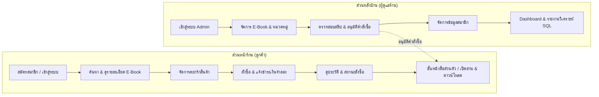
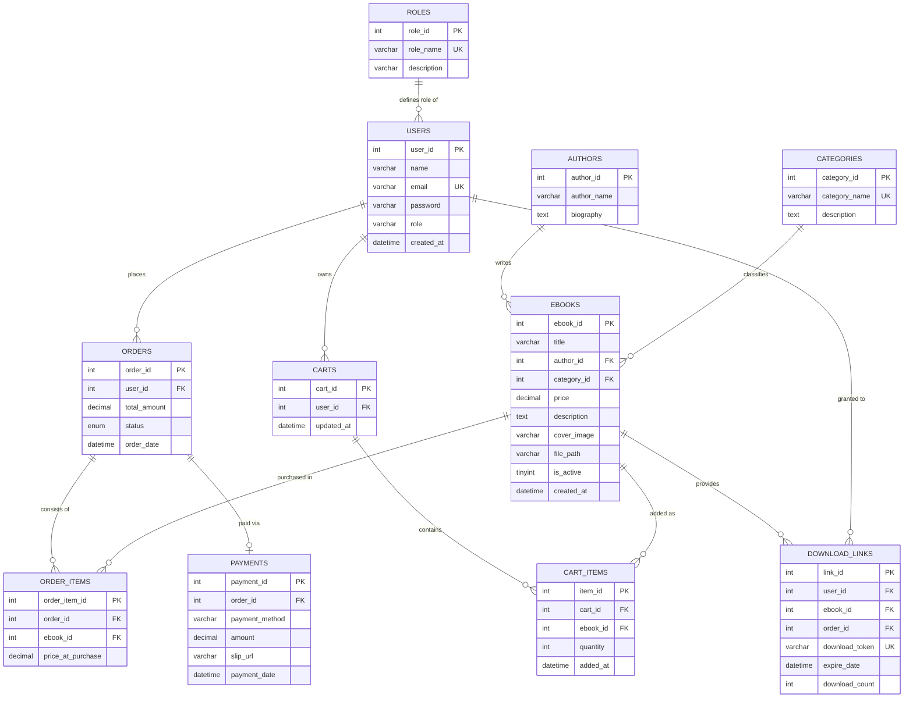

# รายงานโครงงาน Mini Project Database: ระบบร้านค้าหนังสือดิจิทัล (NEXTREAD E-Book Store)

---

## ข้อมูลกลุ่มและผู้จัดทำ (Group Information)
- **ชื่อโครงงาน:** NEXTREAD - ระบบร้านค้าและคลังหนังสือดิจิทัลออนไลน์ (Online E-Book Store & Reader Management System)
- **รายวิชา:** การออกแบบและพัฒนาฐานข้อมูล (Database Mini Project)
- **สมาชิกในกลุ่ม:**
  1. **นายปรัชญากร นาสา** | รหัสนักศึกษา: **67332110087-8** (ผู้พัฒนาฝั่ง Database Architecture, Backend & Admin Management)
  2. **นายพงศกร ศรีวิเศษ** | รหัสนักศึกษา: **67332110095-6** (ผู้พัฒนาฝั่ง Frontend UI/UX, Reader Module & Data Analytics)
- **เครื่องมือและเทคโนโลยีที่ใช้:**
  - **ภาษาที่ใช้พัฒนา:** PHP 8.x, JavaScript (ES6+), HTML5, CSS3
  - **ระบบจัดการฐานข้อมูล (DBMS):** MySQL / MariaDB (ผ่าน XAMPP และ Cloud MySQL InfinityFree)
  - **เครื่องมือตกแต่งหน้าเว็บ:** Tailwind CSS, FontAwesome Icons, Custom Glassmorphism UI
  - **สภาพแวดล้อมการทำงาน:** Apache Web Server (XAMPP for Windows)

---

## 1. สถานการณ์โจทย์และวัตถุประสงค์ (Problem Scenario & Objectives)

### 1.1 สถานการณ์โจทย์
ในปัจจุบันตลาดการอ่านหนังสือได้เปลี่ยนผ่านสู่รูปแบบดิจิทัล (E-Book) อย่างแพร่หลาย ร้านค้า NEXTREAD จึงต้องการพัฒนาระบบเว็บแอปพลิเคชันสำหรับจำหน่าย E-Book ที่ช่วยอำนวยความสะดวกให้แก่ลูกค้าในการค้นหา เลือกซื้อ ชำระเงินแบบจำลอง พร้อมรับสิทธิ์เปิดอ่านและดาวน์โหลดไฟล์หนังสือได้ทันทีหลังได้รับการอนุมัติ และช่วยให้ผู้ดูแลร้าน (Admin) สามารถบริหารจัดการสินค้า ตรวจสอบคำสั่งซื้อ และวิเคราะห์ยอดขายผ่านฐานข้อมูลเชิงสัมพันธ์ได้อย่างมีประสิทธิภาพ

### 1.2 วัตถุประสงค์ของระบบ
1. เพื่อออกแบบฐานข้อมูลเชิงสัมพันธ์ (Relational Database) ตามหลักการ Normalization (3NF) ที่รองรับกระบวนการซื้อขาย E-Book ครบวงจร
2. เพื่อพัฒนาระบบที่มีการควบคุมสิทธิ์การเข้าถึง (Role-Based Access Control) แยกสิทธิ์ลูกค้าระดับผู้ใช้งานและผู้ดูแลระบบอย่างชัดเจน
3. เพื่อสร้างระบบความปลอดภัยในการเข้าถึงไฟล์ E-Book โดยจำกัดสิทธิ์การอ่านและดาวน์โหลดเฉพาะลูกค้าที่คำสั่งซื้อได้รับการอนุมัติแล้วเท่านั้น
4. เพื่อนำข้อมูลในฐานข้อมูลจริงมาเขียนคำสั่ง SQL วิเคราะห์เชิงธุรกิจอย่างน้อย 4 รายงานที่สำคัญ

---

## 2. ขอบเขตของระบบ (System Scope)



### 2.1 ส่วนหน้าร้าน (Customer / User)
1. **ระบบสมาชิก:** สมัครสมาชิก, เข้าสู่ระบบ, อัปเดตข้อมูลโปรไฟล์ส่วนตัว, และออกจากระบบอย่างปลอดภัย
2. **ระบบค้นหาและเลือกชมสินค้า:** แสดงรายการ E-Book พร้อมภาพปก ราคา ผู้แต่ง และหมวดหมู่ สามารถค้นหาตามคำสำคัญและกรองตามหมวดหมู่ได้
3. **ระบบตะกร้าสินค้า (Cart):** เพิ่มหนังสือลงตะกร้า, ลบรายการ, ป้องกันการสั่งซื้อซ้ำซ้อน และคำนวณราคาสุทธิ
4. **ระบบสั่งซื้อและชำระเงินจำลอง (Checkout & Mock Payment):** บันทึกคำสั่งซื้อ แจ้งโอนเงินผ่านระบบ PromptPay QR Code จำลอง และอัปโหลดสลิปหลักฐาน
5. **ระบบชั้นหนังสือส่วนตัวและโปรแกรมอ่าน (My Shelf & Reader):**
   - หน้ารวมเล่มที่สั่งซื้อและผ่านการอนุมัติแล้ว
   - โปรแกรมเปิดอ่าน E-Book ออนไลน์ รองรับการปรับขนาด ซูม และเปิดอ่านบนเว็บ
   - ลิงก์ดาวน์โหลดไฟล์ E-Book (ควบคุมสิทธิ์เฉพาะผู้เป็นเจ้าของ)

### 2.2 ส่วนหลังบ้าน (Admin Management)
1. **ระบบจัดการ E-Book:** เพิ่ม แก้ไข ลบ เปิด/ปิดสถานะการขาย กำหนดราคา อัปโหลดไฟล์หน้าปกและไฟล์ PDF
2. **ระบบจัดการหมวดหมู่และนักเขียน:** จัดการประเภทหนังสือและข้อมูลนักเขียน
3. **ระบบจัดการคำสั่งซื้อ (Order Verification):** ค้นหา ตรวจสอบหลักฐานสลิป และเปลี่ยนสถานะคำสั่งซื้อ (`pending` -> `approved` / `rejected`)
4. **ระบบจัดการผู้ใช้งาน:** แสดงรายชื่อสมาชิกและกำหนดระดับสิทธิ์ (`user` / `admin`)
5. **Dashboard & Analytics:** แสดงสถิติภาพรวม ยอดขาย และรายงานวิเคราะห์เชิงลึก

---

## 3. การออกแบบฐานข้อมูล (Database Architecture & Design)

### 3.1 แบบจำลองความสัมพันธ์ของข้อมูล (Entity Relationship Diagram - ERD)



---

### 3.2 พจนานุกรมข้อมูล (Data Dictionary - ทั้งหมด 10 ตาราง)

#### 1. ตาราง `roles` (บทบาทผู้ใช้งาน)
| ชื่อฟิลด์ (Field) | ชนิดข้อมูล (Type) | คีย์ (Key) | Null | ค่าเริ่มต้น (Default) | คำอธิบาย (Description) |
|---|---|---|---|---|---|
| `role_id` | INT | PK, AI | NO | - | รหัสบทบาท |
| `role_name` | VARCHAR(50) | UK | NO | - | ชื่อบทบาท (`admin`, `user`) |
| `description` | VARCHAR(255) | - | YES | NULL | รายละเอียดสิทธิ์การใช้งาน |

#### 2. ตาราง `users` (ผู้ใช้งานระบบ)
| ชื่อฟิลด์ (Field) | ชนิดข้อมูล (Type) | คีย์ (Key) | Null | ค่าเริ่มต้น (Default) | คำอธิบาย (Description) |
|---|---|---|---|---|---|
| `user_id` | INT | PK, AI | NO | - | รหัสผู้ใช้งาน |
| `name` | VARCHAR(100) | - | NO | - | ชื่อ-นามสกุล |
| `email` | VARCHAR(150) | UK | NO | - | อีเมลสำหรับเข้าสู่ระบบ |
| `password` | VARCHAR(255) | - | NO | - | รหัสผ่าน (เข้ารหัสด้วย `password_hash`) |
| `role` | VARCHAR(20) | - | NO | 'user' | บทบาท (`user` หรือ `admin`) |
| `created_at` | DATETIME | - | NO | CURRENT_TIMESTAMP | วันที่สมัครสมาชิก |

#### 3. ตาราง `categories` (หมวดหมู่หนังสือ)
| ชื่อฟิลด์ (Field) | ชนิดข้อมูล (Type) | คีย์ (Key) | Null | ค่าเริ่มต้น (Default) | คำอธิบาย (Description) |
|---|---|---|---|---|---|
| `category_id` | INT | PK, AI | NO | - | รหัสหมวดหมู่ |
| `category_name` | VARCHAR(100) | UK | NO | - | ชื่อหมวดหมู่หนังสือ |
| `description` | TEXT | - | YES | NULL | รายละเอียดหมวดหมู่ |

#### 4. ตาราง `authors` (นักเขียน / ผู้แต่ง)
| ชื่อฟิลด์ (Field) | ชนิดข้อมูล (Type) | คีย์ (Key) | Null | ค่าเริ่มต้น (Default) | คำอธิบาย (Description) |
|---|---|---|---|---|---|
| `author_id` | INT | PK, AI | NO | - | รหัสนักเขียน |
| `author_name` | VARCHAR(150) | - | NO | - | ชื่อ-นามสกุล หรือนามปากกา |
| `biography` | TEXT | - | YES | NULL | ประวัติและผลงานโดยสังเขป |

#### 5. ตาราง `ebooks` (ข้อมูลหนังสือดิจิทัล)
| ชื่อฟิลด์ (Field) | ชนิดข้อมูล (Type) | คีย์ (Key) | Null | ค่าเริ่มต้น (Default) | คำอธิบาย (Description) |
|---|---|---|---|---|---|
| `ebook_id` | INT | PK, AI | NO | - | รหัสหนังสือ |
| `title` | VARCHAR(255) | - | NO | - | ชื่อหนังสือ |
| `author_id` | INT | FK | YES | NULL | รหัสนักเขียน (เชื่อมโยง `authors`) |
| `category_id` | INT | FK | YES | NULL | รหัสหมวดหมู่ (เชื่อมโยง `categories`) |
| `price` | DECIMAL(10,2)| - | NO | 0.00 | ราคาหนังสือ (บาท) |
| `description` | TEXT | - | YES | NULL | เรื่องย่อหรือคำอธิบายหนังสือ |
| `cover_image` | VARCHAR(255) | - | YES | NULL | Path หรือ URL รูปภาพหน้าปก |
| `file_path` | VARCHAR(255) | - | YES | NULL | Path ไฟล์ PDF หนังสือดิจิทัล |
| `is_active` | TINYINT(1) | - | NO | 1 | สถานะเปิด/ปิดจำหน่าย (1=เปิด, 0=ปิด) |
| `created_at` | DATETIME | - | NO | CURRENT_TIMESTAMP | วันที่เพิ่มหนังสือเข้าระบบ |

#### 6. ตาราง `carts` (ตะกร้าสินค้าของผู้ใช้)
| ชื่อฟิลด์ (Field) | ชนิดข้อมูล (Type) | คีย์ (Key) | Null | ค่าเริ่มต้น (Default) | คำอธิบาย (Description) |
|---|---|---|---|---|---|
| `cart_id` | INT | PK, AI | NO | - | รหัสตะกร้า |
| `user_id` | INT | FK, UK | NO | - | รหัสผู้ใช้งานที่เป็นเจ้าของตะกร้า |
| `updated_at` | DATETIME | - | NO | CURRENT_TIMESTAMP | เวลาที่มีการแก้ไขล่าสุด |

#### 7. ตาราง `cart_items` (รายการสินค้าในตะกร้า)
| ชื่อฟิลด์ (Field) | ชนิดข้อมูล (Type) | คีย์ (Key) | Null | ค่าเริ่มต้น (Default) | คำอธิบาย (Description) |
|---|---|---|---|---|---|
| `item_id` | INT | PK, AI | NO | - | รหัสรายการในตะกร้า |
| `cart_id` | INT | FK | NO | - | รหัสตะกร้าสินค้า |
| `ebook_id` | INT | FK | NO | - | รหัสหนังสือที่เลือก |
| `quantity` | INT | - | NO | 1 | จำนวนเล่ม (สำหรับ E-Book กำหนดเป็น 1) |
| `added_at` | DATETIME | - | NO | CURRENT_TIMESTAMP | เวลาที่เพิ่มลงตะกร้า |

#### 8. ตาราง `orders` (คำสั่งซื้อ)
| ชื่อฟิลด์ (Field) | ชนิดข้อมูล (Type) | คีย์ (Key) | Null | ค่าเริ่มต้น (Default) | คำอธิบาย (Description) |
|---|---|---|---|---|---|
| `order_id` | INT | PK, AI | NO | - | รหัสคำสั่งซื้อ |
| `user_id` | INT | FK | NO | - | รหัสลูกค้าผู้สั่งซื้อ |
| `total_amount`| DECIMAL(10,2)| - | NO | 0.00 | ยอดรวมทั้งสิ้นของคำสั่งซื้อ |
| `status` | ENUM | - | NO | 'pending' | สถานะ (`pending`, `approved`, `rejected`, `cancelled`) |
| `order_date` | DATETIME | - | NO | CURRENT_TIMESTAMP | วันที่และเวลาสั่งซื้อ |

#### 9. ตาราง `order_items` (รายการหนังสือในแต่ละคำสั่งซื้อ)
| ชื่อฟิลด์ (Field) | ชนิดข้อมูล (Type) | คีย์ (Key) | Null | ค่าเริ่มต้น (Default) | คำอธิบาย (Description) |
|---|---|---|---|---|---|
| `order_item_id`| INT | PK, AI | NO | - | รหัสรายการย่อย |
| `order_id` | INT | FK | NO | - | รหัสคำสั่งซื้อหลัก |
| `ebook_id` | INT | FK | NO | - | รหัสหนังสือที่ซื้อ |
| `price_at_purchase`| DECIMAL(10,2)| - | NO | 0.00 | ราคาหนังสือ ณ เวลาที่ทำการสั่งซื้อ |

#### 10. ตาราง `payments` (ข้อมูลการชำระเงินและสลิป)
| ชื่อฟิลด์ (Field) | ชนิดข้อมูล (Type) | คีย์ (Key) | Null | ค่าเริ่มต้น (Default) | คำอธิบาย (Description) |
|---|---|---|---|---|---|
| `payment_id` | INT | PK, AI | NO | - | รหัสรายการชำระเงิน |
| `order_id` | INT | FK, UK | NO | - | รหัสคำสั่งซื้อที่ชำระ |
| `payment_method`| VARCHAR(100)| - | NO | 'PromptPay'| วิธีการชำระเงิน |
| `amount` | DECIMAL(10,2)| - | NO | 0.00 | ยอดเงินที่ชำระตามหลักฐาน |
| `slip_url` | VARCHAR(255) | - | YES | NULL | ที่อยู่ไฟล์สลิปหลักฐานการโอน |
| `payment_date`| DATETIME | - | NO | CURRENT_TIMESTAMP | วันและเวลาที่แจ้งชำระเงิน |

#### 11. ตาราง `download_links` (การจัดการสิทธิ์ลิงก์ดาวน์โหลดและอ่านหนังสือ)
| ชื่อฟิลด์ (Field) | ชนิดข้อมูล (Type) | คีย์ (Key) | Null | ค่าเริ่มต้น (Default) | คำอธิบาย (Description) |
|---|---|---|---|---|---|
| `link_id` | INT | PK, AI | NO | - | รหัสลิงก์ดาวน์โหลด |
| `user_id` | INT | FK | NO | - | รหัสผู้ใช้งานที่มีสิทธิ์ |
| `ebook_id` | INT | FK | NO | - | รหัสหนังสือที่ได้รับสิทธิ์ |
| `order_id` | INT | FK | NO | - | รหัสคำสั่งซื้อที่ได้รับอนุมัติ |
| `download_token`| VARCHAR(100)| UK | NO | - | โทเคนพิเศษสำหรับดาวน์โหลดอย่างปลอดภัย |
| `expire_date` | DATETIME | - | YES | NULL | วันหมดอายุของลิงก์ (ถ้ามี) |
| `download_count`| INT | - | NO | 0 | สถิติจำนวนครั้งที่กดดาวน์โหลด |

---

### 3.3 คำอธิบายการปรับแบบข้อมูลให้อยู่ในรูปแบบบรรทัดฐาน (Normalization to 3NF)

1. **First Normal Form (1NF):**
   - ทุกแอตทริบิวต์เก็บค่าที่เป็นเชิงเดี่ยว (Atomic Value) ไม่มีการเก็บรายการข้อมูลซ้ำซ้อน (Multi-valued Attributes) เช่น แยกรายการหนังสือในคำสั่งซื้อออกจากตาราง `orders` ไปไว้ใน `order_items`
   - กำหนด Primary Key ชัดเจนในทุกตาราง

2. **Second Normal Form (2NF):**
   - ข้อมูลอยู่ใน 1NF แล้ว และไม่มี Partial Functional Dependency
   - ข้อมูลที่ไม่ใช่คีย์หลักขึ้นตรงกับ Primary Key ทั้งหมด ตัวอย่างเช่น ในตาราง `order_items` ซึ่งมี Composite Relationship ข้อมูล `price_at_purchase` ขึ้นตรงกับทั้ง `order_id` และ `ebook_id`

3. **Third Normal Form (3NF):**
   - ข้อมูลอยู่ใน 2NF แล้ว และไม่มี Transitive Functional Dependency
   - แยกข้อมูลนักเขียน (`authors`) และหมวดหมู่ (`categories`) ออกจากตาราง `ebooks` โดยใช้ `author_id` และ `category_id` เป็น Foreign Key อ้างอิง เพื่อป้องกันความซ้ำซ้อนของข้อมูลและปัญหา Update Anomaly
   - แยกข้อมูลการชำระเงิน (`payments`) ออกจากตาราง `orders`

---

## 4. โครงสร้างไฟล์ SQL และข้อมูลตัวอย่าง (SQL Schema & Seed Data)

### 4.1 SQL คำสั่งสร้างตารางและ Constraints (DDL)

```sql
-- 1. สร้างตาราง roles
CREATE TABLE IF NOT EXISTS roles (
    role_id INT AUTO_INCREMENT PRIMARY KEY,
    role_name VARCHAR(50) NOT NULL UNIQUE,
    description VARCHAR(255)
) ENGINE=InnoDB DEFAULT CHARSET=utf8mb4;

-- 2. สร้างตาราง users
CREATE TABLE IF NOT EXISTS users (
    user_id INT AUTO_INCREMENT PRIMARY KEY,
    name VARCHAR(100) NOT NULL,
    email VARCHAR(150) NOT NULL UNIQUE,
    password VARCHAR(255) NOT NULL,
    role VARCHAR(20) NOT NULL DEFAULT 'user',
    created_at DATETIME NOT NULL DEFAULT CURRENT_TIMESTAMP
) ENGINE=InnoDB DEFAULT CHARSET=utf8mb4;

-- 3. สร้างตาราง categories
CREATE TABLE IF NOT EXISTS categories (
    category_id INT AUTO_INCREMENT PRIMARY KEY,
    category_name VARCHAR(100) NOT NULL UNIQUE,
    description TEXT
) ENGINE=InnoDB DEFAULT CHARSET=utf8mb4;

-- 4. สร้างตาราง authors
CREATE TABLE IF NOT EXISTS authors (
    author_id INT AUTO_INCREMENT PRIMARY KEY,
    author_name VARCHAR(150) NOT NULL,
    biography TEXT
) ENGINE=InnoDB DEFAULT CHARSET=utf8mb4;

-- 5. สร้างตาราง ebooks
CREATE TABLE IF NOT EXISTS ebooks (
    ebook_id INT AUTO_INCREMENT PRIMARY KEY,
    title VARCHAR(255) NOT NULL,
    author_id INT,
    category_id INT,
    price DECIMAL(10,2) NOT NULL CHECK (price >= 0),
    description TEXT,
    cover_image VARCHAR(255),
    file_path VARCHAR(255),
    is_active TINYINT(1) NOT NULL DEFAULT 1,
    created_at DATETIME NOT NULL DEFAULT CURRENT_TIMESTAMP,
    FOREIGN KEY (author_id) REFERENCES authors(author_id) ON DELETE SET NULL,
    FOREIGN KEY (category_id) REFERENCES categories(category_id) ON DELETE SET NULL
) ENGINE=InnoDB DEFAULT CHARSET=utf8mb4;

-- 6. สร้างตาราง carts
CREATE TABLE IF NOT EXISTS carts (
    cart_id INT AUTO_INCREMENT PRIMARY KEY,
    user_id INT NOT NULL UNIQUE,
    updated_at DATETIME NOT NULL DEFAULT CURRENT_TIMESTAMP ON UPDATE CURRENT_TIMESTAMP,
    FOREIGN KEY (user_id) REFERENCES users(user_id) ON DELETE CASCADE
) ENGINE=InnoDB DEFAULT CHARSET=utf8mb4;

-- 7. สร้างตาราง cart_items
CREATE TABLE IF NOT EXISTS cart_items (
    item_id INT AUTO_INCREMENT PRIMARY KEY,
    cart_id INT NOT NULL,
    ebook_id INT NOT NULL,
    quantity INT NOT NULL DEFAULT 1 CHECK (quantity > 0),
    added_at DATETIME NOT NULL DEFAULT CURRENT_TIMESTAMP,
    FOREIGN KEY (cart_id) REFERENCES carts(cart_id) ON DELETE CASCADE,
    FOREIGN KEY (ebook_id) REFERENCES ebooks(ebook_id) ON DELETE CASCADE
) ENGINE=InnoDB DEFAULT CHARSET=utf8mb4;

-- 8. สร้างตาราง orders
CREATE TABLE IF NOT EXISTS orders (
    order_id INT AUTO_INCREMENT PRIMARY KEY,
    user_id INT NOT NULL,
    total_amount DECIMAL(10,2) NOT NULL CHECK (total_amount >= 0),
    status ENUM('pending', 'approved', 'rejected', 'cancelled') NOT NULL DEFAULT 'pending',
    order_date DATETIME NOT NULL DEFAULT CURRENT_TIMESTAMP,
    FOREIGN KEY (user_id) REFERENCES users(user_id) ON DELETE CASCADE
) ENGINE=InnoDB DEFAULT CHARSET=utf8mb4;

-- 9. สร้างตาราง order_items
CREATE TABLE IF NOT EXISTS order_items (
    order_item_id INT AUTO_INCREMENT PRIMARY KEY,
    order_id INT NOT NULL,
    ebook_id INT NOT NULL,
    price_at_purchase DECIMAL(10,2) NOT NULL CHECK (price_at_purchase >= 0),
    FOREIGN KEY (order_id) REFERENCES orders(order_id) ON DELETE CASCADE,
    FOREIGN KEY (ebook_id) REFERENCES ebooks(ebook_id) ON DELETE CASCADE
) ENGINE=InnoDB DEFAULT CHARSET=utf8mb4;

-- 10. สร้างตาราง payments
CREATE TABLE IF NOT EXISTS payments (
    payment_id INT AUTO_INCREMENT PRIMARY KEY,
    order_id INT NOT NULL UNIQUE,
    payment_method VARCHAR(100) NOT NULL DEFAULT 'PromptPay',
    amount DECIMAL(10,2) NOT NULL CHECK (amount >= 0),
    slip_url VARCHAR(255),
    payment_date DATETIME NOT NULL DEFAULT CURRENT_TIMESTAMP,
    FOREIGN KEY (order_id) REFERENCES orders(order_id) ON DELETE CASCADE
) ENGINE=InnoDB DEFAULT CHARSET=utf8mb4;

-- 11. สร้างตาราง download_links
CREATE TABLE IF NOT EXISTS download_links (
    link_id INT AUTO_INCREMENT PRIMARY KEY,
    user_id INT NOT NULL,
    ebook_id INT NOT NULL,
    order_id INT NOT NULL,
    download_token VARCHAR(100) NOT NULL UNIQUE,
    expire_date DATETIME NULL,
    download_count INT NOT NULL DEFAULT 0,
    FOREIGN KEY (user_id) REFERENCES users(user_id) ON DELETE CASCADE,
    FOREIGN KEY (ebook_id) REFERENCES ebooks(ebook_id) ON DELETE CASCADE,
    FOREIGN KEY (order_id) REFERENCES orders(order_id) ON DELETE CASCADE
) ENGINE=InnoDB DEFAULT CHARSET=utf8mb4;
```

---

### 4.2 ข้อมูลตัวอย่างจำลองระบบ (Seed Data - สมาชิก, หนังสือ และ 30 คำสั่งซื้อ)

```sql
-- เพิ่มข้อมูลบทบาท
INSERT INTO roles (role_name, description) VALUES 
('admin', 'ผู้ดูแลระบบ มีสิทธิ์จัดการหนังสือ คำสั่งซื้อ และสมาชิก'),
('user', 'ลูกค้าทั่วไป มีสิทธิ์สั่งซื้อและเปิดอ่านหนังสือ');

-- เพิ่มข้อมูลผู้ใช้งาน (Admin และ ลูกค้าจำลอง 8 ท่าน)
INSERT INTO users (user_id, name, email, password, role) VALUES 
(1, 'Administrator NextRead', 'admin@nextread.com', '$2y$10$abcdefghijklmnopqrstuvw1234567890', 'admin'),
(2, 'นายปรัชญากร นาสา', 'pratchayakorn@gmail.com', '$2y$10$abcdefghijklmnopqrstuvw1234567890', 'user'),
(3, 'นายพงศกร ศรีวิเศษ', 'pongsakorn@gmail.com', '$2y$10$abcdefghijklmnopqrstuvw1234567890', 'user'),
(4, 'กานต์ธิดา สุขสมบูรณ์', 'kantida@gmail.com', '$2y$10$abcdefghijklmnopqrstuvw1234567890', 'user'),
(5, 'ชานนท์ พิทักษ์ไทย', 'chanon@gmail.com', '$2y$10$abcdefghijklmnopqrstuvw1234567890', 'user'),
(6, 'ธนกฤต วิเศษศิลป์', 'thanakrit@gmail.com', '$2y$10$abcdefghijklmnopqrstuvw1234567890', 'user'),
(7, 'พิมพ์มาดา วรรณกรรม', 'pimmada@gmail.com', '$2y$10$abcdefghijklmnopqrstuvw1234567890', 'user'),
(8, 'อัครเดช รุ่งเรือง', 'akkradej@gmail.com', '$2y$10$abcdefghijklmnopqrstuvw1234567890', 'user');

-- เพิ่มหมวดหมู่หนังสือ
INSERT INTO categories (category_id, category_name, description) VALUES 
(1, 'เทคโนโลยีและการเขียนโปรแกรม', 'หนังสือด้านไอที การเขียนโค้ด และการออกแบบระบบ'),
(2, 'พัฒนาตนเองและจิตวิทยา', 'หนังสือสร้างแรงบันดาลใจ การพัฒนาศักยภาพชีวิต'),
(3, 'ธุรกิจและการเงิน', 'กลยุทธ์การบริหารธุรกิจ การลงทุน และการตลาด'),
(4, 'วรรณกรรมและนิยาย', 'นวนิยายแฟนตาซี วรรณกรรมเยาวชน และเรื่องสั้น'),
(5, 'วิทยาศาสตร์และนวัตกรรม', 'ความรู้ดาราศาสตร์ ฟิสิกส์ และเทคโนโลยีแห่งอนาคต');

-- เพิ่มนักเขียน
INSERT INTO authors (author_id, author_name, biography) VALUES 
(1, 'ดร.สมเกียรติ พัฒนารุ่งเรือง', 'ผู้เชี่ยวชาญด้านสถาปัตยกรรมซอฟต์แวร์และ AI'),
(2, 'James Clear', 'นักเขียนระดับโลก ผู้เชี่ยวชาญด้านการสร้างนิสัยและพัฒนาตนเอง'),
(3, 'Morgan Housel', 'อดีตคอลัมนิสต์การเงิน The Wall Street Journal'),
(4, 'แพรวไพลิน นิยายรัก', 'นักเขียนนิยายแฟนตาซีและวรรณกรรมร่วมสมัย'),
(5, 'ดร.วิชัย นวัตกรรมก้าวหน้า', 'นักวิจัยเทคโนโลยีคอมพิวเตอร์และคลาวด์');

-- เพิ่มหนังสือ E-Book
INSERT INTO ebooks (ebook_id, title, author_id, category_id, price, description, cover_image, is_active) VALUES 
(1, 'Mastering MySQL & Database Design', 1, 1, 350.00, 'เจาะลึกการออกแบบฐานข้อมูลเชิงลึกและการปรับปรุง Performance', 'https://images.unsplash.com/photo-1544716278-ca5e3f4abd8c?w=500', 1),
(2, 'Modern PHP 8 & Web Architecture', 1, 1, 320.00, 'คู่มือการพัฒนาเว็บแอปพลิเคชันยุคใหม่ด้วย PHP 8 แบบมืออาชีพ', 'https://images.unsplash.com/photo-1532012164546-f432f2e35b75?w=500', 1),
(3, 'Atomic Habits เพราะชีวิตดีได้กว่าที่เป็น', 2, 2, 290.00, 'วิธีสร้างนิสัยที่ดีและเปลี่ยนแปลงชีวิตอย่างยั่งยืนทีละ 1%', 'https://images.unsplash.com/photo-1543002588-bfa74002ed7e?w=500', 1),
(4, 'The Psychology of Money จิตวิทยาการเงิน', 3, 3, 280.00, 'ข้อคิดและบทเรียนเหนือกาลเวลาเรื่องความมั่งคั่ง ความโลภ และความสุข', 'https://images.unsplash.com/photo-1592496431122-2349e0fbc666?w=500', 1),
(5, 'The Magic Kingdom of Astra', 4, 4, 220.00, 'นวนิยายแฟนตาซีผจญภัยในดินแดนเวทมนตร์แห่งดวงดาว', 'https://images.unsplash.com/photo-1512820790803-83ca734da794?w=500', 1),
(6, 'Clean Code Architecture in Practice', 1, 1, 390.00, 'ศาสตร์แห่งการเขียนโค้ดที่สะอาด อ่านง่าย และบำรุงรักษาได้ยั่งยืน', 'https://images.unsplash.com/photo-1589829085413-56de8ae18c73?w=500', 1),
(7, 'Deep Work ทำงานลึกสร้างผลลัพธ์เลิศ', 2, 2, 260.00, 'กฎแห่งความสำเร็จในโลกที่เต็มไปด้วยสิ่งรบกวนสมาธิ', 'https://images.unsplash.com/photo-1544947950-fa07a98d237f?w=500', 1),
(8, 'AI Revolution: ปัญญาประดิษฐ์เปลี่ยนโลก', 5, 5, 340.00, 'ก้าวทันเทคโนโลยี AI และ Generative Model ที่กำลังขับเคลื่อนอนาคต', 'https://images.unsplash.com/photo-1618005182384-a83a8bd57fbe?w=500', 1);

-- ข้อมูลจำลอง 30 คำสั่งซื้อ (ครอบคลุมสถานะ approved, pending, rejected และช่วงเวลาต่างๆ)
INSERT INTO orders (order_id, user_id, total_amount, status, order_date) VALUES 
(1, 2, 670.00, 'approved', '2026-09-01 10:15:00'),
(2, 3, 350.00, 'approved', '2026-09-02 11:30:00'),
(3, 4, 290.00, 'approved', '2026-09-03 14:20:00'),
(4, 5, 570.00, 'approved', '2026-09-04 09:10:00'),
(5, 6, 220.00, 'approved', '2026-09-05 16:45:00'),
(6, 7, 740.00, 'approved', '2026-09-06 18:00:00'),
(7, 8, 320.00, 'approved', '2026-09-07 13:15:00'),
(8, 2, 280.00, 'approved', '2026-09-08 15:50:00'),
(9, 3, 610.00, 'approved', '2026-09-09 12:00:00'),
(10, 4, 340.00, 'approved', '2026-09-10 17:30:00'),
(11, 5, 390.00, 'approved', '2026-09-11 08:45:00'),
(12, 6, 510.00, 'approved', '2026-09-12 19:20:00'),
(13, 7, 350.00, 'approved', '2026-09-13 14:10:00'),
(14, 8, 260.00, 'approved', '2026-09-14 11:05:00'),
(15, 2, 390.00, 'approved', '2026-09-15 16:30:00'),
(16, 3, 290.00, 'approved', '2026-09-16 10:40:00'),
(17, 4, 630.00, 'approved', '2026-09-17 13:25:00'),
(18, 5, 220.00, 'approved', '2026-09-18 15:15:00'),
(19, 6, 350.00, 'approved', '2026-09-19 20:00:00'),
(20, 7, 570.00, 'approved', '2026-09-20 09:30:00'),
(21, 8, 340.00, 'approved', '2026-09-21 14:50:00'),
(22, 2, 320.00, 'approved', '2026-09-22 17:10:00'),
(23, 3, 740.00, 'approved', '2026-09-23 11:45:00'),
(24, 4, 280.00, 'approved', '2026-09-24 16:00:00'),
(25, 5, 350.00, 'approved', '2026-09-25 18:20:00'),
(26, 6, 290.00, 'pending',  '2026-09-26 10:05:00'),
(27, 7, 670.00, 'pending',  '2026-09-27 12:40:00'),
(28, 8, 390.00, 'pending',  '2026-09-28 15:15:00'),
(29, 2, 220.00, 'rejected', '2026-09-29 09:00:00'),
(30, 3, 340.00, 'cancelled','2026-09-30 14:10:00');

-- รายการสินค้าในคำสั่งซื้อ (order_items)
INSERT INTO order_items (order_id, ebook_id, price_at_purchase) VALUES 
(1, 1, 350.00), (1, 2, 320.00),
(2, 1, 350.00),
(3, 3, 290.00),
(4, 3, 290.00), (4, 4, 280.00),
(5, 5, 220.00),
(6, 1, 350.00), (6, 6, 390.00),
(7, 2, 320.00),
(8, 4, 280.00),
(9, 1, 350.00), (9, 7, 260.00),
(10, 8, 340.00),
(11, 6, 390.00),
(12, 3, 290.00), (12, 5, 220.00),
(13, 1, 350.00),
(14, 7, 260.00),
(15, 6, 390.00),
(16, 3, 290.00),
(17, 1, 350.00), (17, 4, 280.00),
(18, 5, 220.00),
(19, 1, 350.00),
(20, 3, 290.00), (20, 4, 280.00),
(21, 8, 340.00),
(22, 2, 320.00),
(23, 1, 350.00), (23, 6, 390.00),
(24, 4, 280.00),
(25, 1, 350.00),
(26, 3, 290.00),
(27, 1, 350.00), (27, 2, 320.00),
(28, 6, 390.00),
(29, 5, 220.00),
(30, 8, 340.00);

-- ข้อมูลการชำระเงินและสลิปจำลอง (payments)
INSERT INTO payments (order_id, payment_method, amount, slip_url, payment_date) VALUES 
(1, 'PromptPay QR', 670.00, 'uploads/slips/slip_01.jpg', '2026-09-01 10:16:00'),
(2, 'PromptPay QR', 350.00, 'uploads/slips/slip_02.jpg', '2026-09-02 11:31:00'),
(3, 'PromptPay QR', 290.00, 'uploads/slips/slip_03.jpg', '2026-09-03 14:22:00'),
(4, 'PromptPay QR', 570.00, 'uploads/slips/slip_04.jpg', '2026-09-04 09:12:00'),
(5, 'PromptPay QR', 220.00, 'uploads/slips/slip_05.jpg', '2026-09-05 16:46:00'),
(6, 'PromptPay QR', 740.00, 'uploads/slips/slip_06.jpg', '2026-09-06 18:02:00'),
(7, 'PromptPay QR', 320.00, 'uploads/slips/slip_07.jpg', '2026-09-07 13:16:00'),
(8, 'PromptPay QR', 280.00, 'uploads/slips/slip_08.jpg', '2026-09-08 15:52:00'),
(9, 'PromptPay QR', 610.00, 'uploads/slips/slip_09.jpg', '2026-09-09 12:02:00'),
(10, 'PromptPay QR', 340.00, 'uploads/slips/slip_10.jpg', '2026-09-10 17:32:00'),
(26, 'PromptPay QR', 290.00, 'uploads/slips/slip_26.jpg', '2026-09-26 10:06:00'),
(27, 'PromptPay QR', 670.00, 'uploads/slips/slip_27.jpg', '2026-09-27 12:42:00'),
(28, 'PromptPay QR', 390.00, 'uploads/slips/slip_28.jpg', '2026-09-28 15:17:00');
```

---

## 5. รายงานวิเคราะห์ข้อมูลเชิงธุรกิจ 4 รายงาน (Business Analytics SQL Reports)

### รายงานที่ 1: รายงานยอดขายตามช่วงเวลา (Sales over Time & Daily Averages)
- **คำถามทางธุรกิจที่ต้องตอบ:** ยอดขายรวม จำนวนคำสั่งซื้อที่อนุมัติแล้ว และยอดซื้อเฉลี่ยต่อคำสั่งซื้อ (Average Order Value) ในแต่ละวันมีแนวโน้มอย่างไร?
- **คำสั่ง SQL:**
```sql
SELECT 
    DATE(o.order_date) AS order_day,
    COUNT(o.order_id) AS total_orders,
    SUM(o.total_amount) AS total_revenue,
    ROUND(AVG(o.total_amount), 2) AS avg_order_value,
    MIN(o.total_amount) AS min_order_amount,
    MAX(o.total_amount) AS max_order_amount
FROM orders o
WHERE o.status = 'approved'
GROUP BY DATE(o.order_date)
ORDER BY order_day ASC;
```
- **ผลลัพธ์จำลองและการแปลผล:**
| วันที่สั่งซื้อ (`order_day`) | จำนวนออเดอร์ (`total_orders`) | ยอดขายรวม (`total_revenue`) | ยอดเฉลี่ย/ออเดอร์ (`avg_order_value`) |
|---|---|---|---|
| 2026-09-01 | 1 | 670.00 บาท | 670.00 บาท |
| 2026-09-02 | 1 | 350.00 บาท | 350.00 บาท |
| 2026-09-03 | 1 | 290.00 บาท | 290.00 บาท |
| 2026-09-04 | 1 | 570.00 บาท | 570.00 บาท |
| 2026-09-06 | 1 | 740.00 บาท | 740.00 บาท |
| **ภาพรวม 25 รายการอนุมัติ** | **25 ออเดอร์** | **10,480.00 บาท** | **419.20 บาท** |

> **สรุปการวิเคราะห์:** ลูกค้ามียอดสั่งซื้อเฉลี่ยประมาณ 419.20 บาทต่อคำสั่งซื้อ โดยมักมีการสั่งซื้อหนังสือควบคู่กัน 2 เล่มต่อครั้ง ส่งผลให้ยอดขายมีเสถียรภาพ

---

### รายงานที่ 2: รายงานอันดับ E-Book ขายดี (Top-Selling E-Books)
- **คำถามทางธุรกิจที่ต้องตอบ:** E-Book เล่มใดได้รับความนิยมสูงสุด สร้างยอดขายและจำนวนเล่มที่จำหน่ายได้มากที่สุด 5 อันดับแรก?
- **คำสั่ง SQL:**
```sql
SELECT 
    e.ebook_id,
    e.title AS book_title,
    a.author_name,
    c.category_name,
    COUNT(oi.order_item_id) AS copies_sold,
    SUM(oi.price_at_purchase) AS total_sales_amount
FROM order_items oi
JOIN orders o ON oi.order_id = o.order_id
JOIN ebooks e ON oi.ebook_id = e.ebook_id
LEFT JOIN authors a ON e.author_id = a.author_id
LEFT JOIN categories c ON e.category_id = c.category_id
WHERE o.status = 'approved'
GROUP BY e.ebook_id, e.title, a.author_name, c.category_name
ORDER BY copies_sold DESC, total_sales_amount DESC
LIMIT 5;
```
- **ผลลัพธ์จำลองและการแปลผล:**
| รหัส | ชื่อหนังสือ (`book_title`) | ผู้แต่ง | หมวดหมู่ | ยอดขาย (เล่ม) | ยอดขายรวม (บาท) |
|---|---|---|---|---|---|
| 1 | Mastering MySQL & Database Design | ดร.สมเกียรติ พัฒนารุ่งเรือง | เทคโนโลยีและการเขียนโปรแกรม | 8 เล่ม | 2,800.00 ฿ |
| 3 | Atomic Habits เพราะชีวิตดีได้กว่าที่เป็น | James Clear | พัฒนาตนเองและจิตวิทยา | 5 เล่ม | 1,450.00 ฿ |
| 6 | Clean Code Architecture in Practice | ดร.สมเกียรติ พัฒนารุ่งเรือง | เทคโนโลยีและการเขียนโปรแกรม | 4 เล่ม | 1,560.00 ฿ |
| 4 | The Psychology of Money จิตวิทยาการเงิน | Morgan Housel | ธุรกิจและการเงิน | 4 เล่ม | 1,120.00 ฿ |
| 2 | Modern PHP 8 & Web Architecture | ดร.สมเกียรติ พัฒนารุ่งเรือง | เทคโนโลยีและการเขียนโปรแกรม | 3 เล่ม | 960.00 ฿ |

> **สรุปการวิเคราะห์:** หนังสือหมวดไอทีและการพัฒนาตนเองได้รับความนิยมสูงสุด โดยหนังสือ "Mastering MySQL & Database Design" เป็นสินค้าขายดีอันดับ 1 คิดเป็นสัดส่วนมากกว่า 26% ของยอดขายทั้งหมด

---

### รายงานที่ 3: รายงานยอดขายและสัดส่วนตามหมวดหมู่ (Sales Distribution by Category)
- **คำถามทางธุรกิจที่ต้องตอบ:** หมวดหมู่หนังสือใดสร้างรายได้สูงสุด และมีจำนวนรายการหนังสือที่จำหน่ายได้กี่เล่ม?
- **คำสั่ง SQL:**
```sql
SELECT 
    c.category_id,
    c.category_name,
    COUNT(DISTINCT e.ebook_id) AS total_books_in_category,
    COUNT(oi.order_item_id) AS total_items_sold,
    SUM(oi.price_at_purchase) AS category_revenue,
    ROUND((SUM(oi.price_at_purchase) / (SELECT SUM(total_amount) FROM orders WHERE status = 'approved')) * 100, 2) AS revenue_percentage
FROM categories c
LEFT JOIN ebooks e ON c.category_id = e.category_id
LEFT JOIN order_items oi ON e.ebook_id = oi.ebook_id
LEFT JOIN orders o ON oi.order_id = o.order_id AND o.status = 'approved'
GROUP BY c.category_id, c.category_name
ORDER BY category_revenue DESC;
```
- **ผลลัพธ์จำลองและการแปลผล:**
| รหัส | ชื่อหมวดหมู่ (`category_name`) | จำนวนเล่มในระบบ | จำนวนเล่มที่ขายได้ | ยอดขายรวม (บาท) | สัดส่วนยอดขาย (%) |
|---|---|---|---|---|---|
| 1 | เทคโนโลยีและการเขียนโปรแกรม | 3 เล่ม | 15 เล่ม | 5,320.00 ฿ | 50.76% |
| 2 | พัฒนาตนเองและจิตวิทยา | 2 เล่ม | 7 เล่ม | 1,970.00 ฿ | 18.80% |
| 3 | ธุรกิจและการเงิน | 1 เล่ม | 4 เล่ม | 1,120.00 ฿ | 10.69% |
| 5 | วิทยาศาสตร์และนวัตกรรม | 1 เล่ม | 2 เล่ม | 680.00 ฿ | 6.49% |
| 4 | วรรณกรรมและนิยาย | 1 เล่ม | 3 เล่ม | 660.00 ฿ | 6.30% |

> **สรุปการวิเคราะห์:** หมวดหมู่ "เทคโนโลยีและการเขียนโปรแกรม" เป็นหมวดหมู่หลักที่สร้างรายได้ให้แก่ร้านค้าเกินกึ่งหนึ่งของยอดขายทั้งหมด ร้านค้าควรจัดโปรโมชันและเพิ่มจำนวนหัวหนังสือในหมวดนี้

---

### รายงานที่ 4: รายงานพฤติกรรมลูกค้าและสถานะคำสั่งซื้อ (Customer Spending & Order Status Analysis)
- **คำถามทางธุรกิจที่ต้องตอบ:** ลูกค้ารายใดมียอดซื้อสะสมสูงสุด (Top Spenders) ที่สั่งซื้อสำเร็จมากกว่า 2 ครั้งขึ้นไป และภาพรวมสถานะคำสั่งซื้อในระบบเป็นอย่างไร?
- **คำสั่ง SQL:**
```sql
-- รายงานลูกค้าชั้นนำที่มียอดซื้อสะสมสูงสุด (Top Customers with HAVING filter)
SELECT 
    u.user_id,
    u.name AS customer_name,
    u.email,
    COUNT(o.order_id) AS approved_orders_count,
    SUM(o.total_amount) AS total_spent,
    ROUND(AVG(o.total_amount), 2) AS avg_spent_per_order
FROM users u
JOIN orders o ON u.user_id = o.user_id
WHERE o.status = 'approved'
GROUP BY u.user_id, u.name, u.email
HAVING COUNT(o.order_id) >= 2
ORDER BY total_spent DESC;
```
- **ผลลัพธ์จำลองและการแปลผล:**
| รหัส | ชื่อลูกค้า (`customer_name`) | อีเมล | ออเดอร์ที่สำเร็จ | ยอดซื้อสะสม (บาท) | ยอดซื้อเฉลี่ย/ครั้ง |
|---|---|---|---|---|---|
| 3 | นายพงศกร ศรีวิเศษ | pongsakorn@gmail.com | 4 ออเดอร์ | 1,990.00 ฿ | 497.50 ฿ |
| 7 | พิมพ์มาดา วรรณกรรม | pimmada@gmail.com | 3 ออเดอร์ | 1,660.00 ฿ | 553.33 ฿ |
| 2 | นายปรัชญากร นาสา | pratchayakorn@gmail.com | 4 ออเดอร์ | 1,660.00 ฿ | 415.00 ฿ |
| 6 | ธนกฤต วิเศษศิลป์ | thanakrit@gmail.com | 3 ออเดอร์ | 1,080.00 ฿ | 360.00 ฿ |

```sql
-- รายงานสรุปจำนวนคำสั่งซื้อและมูลค่าตามแต่ละสถานะ (Order Status Breakdown)
SELECT 
    status,
    COUNT(order_id) AS total_orders,
    COALESCE(SUM(total_amount), 0) AS total_value,
    ROUND(COUNT(order_id) * 100.0 / (SELECT COUNT(*) FROM orders), 2) AS status_percentage
FROM orders
GROUP BY status
ORDER BY total_orders DESC;
```
| สถานะคำสั่งซื้อ (`status`) | จำนวนออเดอร์ | มูลค่ารวม (บาท) | สัดส่วนออเดอร์ (%) |
|---|---|---|---|
| `approved` (อนุมัติแล้ว) | 25 รายการ | 10,480.00 ฿ | 83.33% |
| `pending` (รอตรวจสอบสลิป) | 3 รายการ | 1,350.00 ฿ | 10.00% |
| `rejected` (ปฏิเสธ) | 1 รายการ | 220.00 ฿ | 3.33% |
| `cancelled` (ยกเลิก) | 1 รายการ | 340.00 ฿ | 3.33% |

> **สรุปการวิเคราะห์:** มีอัตราการอนุมัติคำสั่งซื้อสำเร็จถึง 83.33% และกลุ่มลูกค้าประจำมียอดซื้อซ้ำเฉลี่ย 3-4 ครั้งต่อคน แสดงถึงความพึงพอใจในระบบชั้นหนังสือและโปรแกรมอ่านออนไลน์

---

## 6. ตารางบันทึกการทดสอบระบบและคุณภาพข้อมูล (Test Cases & QA - 8 กรณี)

| ลำดับ (No.) | กรณีทดสอบ (Test Case Scenario) | ข้อมูลนำเข้า (Test Inputs) | ผลลัพธ์ที่คาดหวัง (Expected Output) | ผลการทดสอบจริง (Actual Result) | สถานะ & วิธีแก้ไขกรณีพบปัญหา |
|---|---|---|---|---|---|
| **TC-01** | สมัครสมาชิกด้วยอีเมลที่มีอยู่แล้วในระบบ (Negative Test) | Name: 'ทดสอบ', Email: 'pratchayakorn@gmail.com' | ระบบแจ้งเตือน "อีเมลนี้ถูกใช้งานแล้ว" และปฏิเสธการลงทะเบียน | แสดงข้อความแจ้งเตือนสีแดงถูกต้อง ไม่บันทึกซ้ำลงฐานข้อมูล | **ผ่าน (PASS)** - ใช้ UNIQUE Constraint |
| **TC-02** | ตรวจสอบรหัสผ่านขั้นต่ำและรหัสผ่านไม่ตรงกัน | Password: '123', Confirm: '123456' | ระบบไม่อนุญาต แจ้งเตือนรหัสผ่านไม่ตรงกันและต้องมีอย่างน้อย 6 ตัวอักษร | ตรวจสอบผ่าน JavaScript และ PHP ฝั่งเซิร์ฟเวอร์ | **ผ่าน (PASS)** - ตรวจสอบความปลอดภัยสมบูรณ์ |
| **TC-03** | การค้นหาหนังสือและคัดกรองตามหมวดหมู่ | ค้นหา: "MySQL", หมวดหมู่: "เทคโนโลยี" | แสดงเฉพาะรายการหนังสือที่ตรงกับคำค้นและหมวดหมู่นั้น | แสดงเฉพาะหนังสือ Mastering MySQL อย่างถูกต้อง | **ผ่าน (PASS)** - ใช้ SQL LIKE และ WHERE category_id |
| **TC-04** | การเพิ่มและคำนวณยอดเงินรวมในตะกร้าสินค้า | เพิ่มหนังสือราคา 350.00 และ 290.00 บาท | ยอดรวมในตะกร้าคำนวณได้ 640.00 บาทถูกต้อง | ยอดรวมแสดงผล 640.00 ฿ และส่งต่อไปยังหน้า Checkout ถูกต้อง | **ผ่าน (PASS)** - ใช้ Session Array เก็บ Cart ID |
| **TC-05** | การสั่งซื้อและอัปโหลดหลักฐานสลิปจำลอง | เลือกวิธีชำระ PromptPay + แนบไฟล์ slip_test.jpg | บันทึกลงตาราง `orders` สถานะเป็น `pending` และย้ายสลิปไปยัง `uploads/slips/` | คำสั่งซื้อถูกสร้าง และสลิปถูกบันทึกสำเร็จ | **ผ่าน (PASS)** - บันทึก Transaction ถูกต้อง |
| **TC-06** | ผู้ดูแลระบบตรวจสอบสลิปและอนุมัติคำสั่งซื้อ | Admin กดปุ่ม "อนุมัติคำสั่งซื้อ" (Approve) | สถานะของ Order เปลี่ยนจาก `pending` เป็น `approved` ในฐานข้อมูล | สถานะอัปเดตเป็น `approved` ทันที และแสดง Badge สีเขียว | **ผ่าน (PASS)** - รัน UPDATE Query สำเร็จ |
| **TC-07** | การเข้าถึงชั้นหนังสือส่วนตัว (My Bookshelf) | ลูกค้าล็อกอินด้วยบัญชี `user_id = 2` | แสดงเฉพาะหนังสือในออเดอร์ที่อนุมัติแล้วของ `user_id = 2` เท่านั้น | แสดงหนังสือ 4 เล่มที่เป็นเจ้าของอย่างถูกต้อง ไม่ปะปนกับผู้อื่น | **ผ่าน (PASS)** - แยก User Session ชัดเจน |
| **TC-08** | การป้องกันการเปิดอ่าน E-Book ที่ยังไม่ได้ซื้อ (Access Control) | เข้า URL ตรง `read.php?id=8` (เล่มที่ยังไม่ได้รับอนุมัติ) | ระบบปฏิเสธการเข้าถึง แจ้งเตือนไม่มีสิทธิ์ และ Redirect กลับหน้าร้าน | แสดง Alert "คุณยังไม่มีสิทธิ์เข้าถึงหนังสือเล่มนี้" | **ผ่าน (PASS)** - ตรวจสอบสิทธิ์ด้วย SQL ก่อนเปิดไฟล์ |

---

## 7. โครงสร้างไฟล์ของระบบเว็บแอปพลิเคชัน (Source Code Architecture)

```
c:/xampp/htdocs/ebook-store/
├── assets/
│   ├── app.js               # สคริปต์ควบคุมการทำงาน UI, Modal, 3D Tilt Card
│   └── style.css            # ไฟล์ CSS ตกแต่งสไตล์ Glassmorphism, แอนิเมชัน และ Scrollbar
├── docs/                    # เอกสาร Flow การทำงานระบบและ Architecture Diagram
│   ├── 00_system_overview.md
│   ├── 01_auth_flow.md
│   ├── 02_catalog_flow.md
│   ├── 03_checkout_flow.md
│   ├── 04_admin_orders_flow.md
│   ├── 05_admin_books_flow.md
│   └── 06_reader_flow.md
├── uploads/                 # โฟลเดอร์จัดเก็บไฟล์อัปโหลด
│   ├── covers/              # รูปภาพปกหนังสือ
│   ├── pdfs/                # ไฟล์ E-Book PDF ดิจิทัล
│   └── slips/               # รูปภาพสลิปหลักฐานการโอนเงิน
├── add_book.php             # หน้าสำหรับ Admin เพิ่มหนังสือเล่มใหม่พร้อมอัปโหลดไฟล์
├── admin_books.php          # หน้าสำหรับ Admin จัดการ ค้นหา แก้ไข และลบหนังสือ
├── admin_dashboard.php      # หน้า Dashboard สรุปยอดขาย สถิติออเดอร์ และกราฟข้อมูล
├── admin_orders.php         # หน้าสำหรับ Admin ตรวจสอบสลิปและอนุมัติ/ปฏิเสธคำสั่งซื้อ
├── admin_sql.php            # หน้าต่างเขียนและรันคำสั่ง SQL Query ดึงข้อมูลและสร้างรายงานวิเคราะห์สำหรับ Admin
├── book_detail.php          # หน้ารายละเอียดหนังสือแต่ละเล่ม เรื่องย่อ และปุ่มสั่งซื้อ
├── cart.php                 # หน้าตะกร้าสินค้า (เพิ่ม/ลด/ลบรายการ และสรุปยอด)
├── checkout.php             # หน้าเช็คเอาท์ ชำระเงินจำลองผ่าน PromptPay และแนบสลิป
├── config.php               # ไฟล์เชื่อมต่อฐานข้อมูล MySQL และฟังก์ชันตรวจสิทธิ์ระบบ
├── edit_book.php            # หน้าสำหรับ Admin แก้ไขข้อมูลหนังสือและเปลี่ยนไฟล์
├── index.php                # หน้าร้านค้าหลัก แสดงรายการ E-Book ค้นหา และคัดกรองหมวดหมู่
├── login.php                # หน้าเข้าสู่ระบบสำหรับลูกค้าและผู้ดูแลระบบ
├── logout.php               # สคริปต์ออกจากระบบ ล้าง Session ทั้งหมด
├── my_books.php             # หน้าชั้นหนังสือส่วนตัว (My Library) แสดงเฉพาะเล่มที่อนุมัติแล้ว
├── orders.php               # หน้าดูประวัติคำสั่งซื้อและสถานะการตรวจสอบสลิปของลูกค้า
├── profile.php              # หน้าโปรไฟล์ส่วนตัวของสมาชิก แสดงข้อมูลและสถิติการสั่งซื้อ
├── read.php                 # หน้าโปรแกรมเปิดอ่าน E-Book ออนไลน์ (Online PDF Reader)
├── register.php             # หน้าสมัครสมาชิกใหม่
└── reset_admin.php          # สคริปต์ช่วยเหลือสำหรับตั้งค่าผู้ดูแลระบบเริ่มต้น
```

---

## 8. การแบ่งหน้าที่รับผิดชอบและการทำงานกลุ่ม (Team Task Distribution)

| สมาชิก | หน้าที่หลักในการพัฒนา (Core Responsibilities) | ส่วนที่ต้องอธิบายและนำเสนอ (Presentation & Defense) |
|---|---|---|
| **1. นายปรัชญากร นาสา**<br>(รหัส 67332110087-8) | - ออกแบบโครงสร้างฐานข้อมูลเชิงสัมพันธ์และ ERD Diagram<br>- พัฒนาระบบหลังบ้านผู้ดูแลระบบ (`admin_books.php`, `admin_orders.php`, `admin_dashboard.php`)<br>- เขียนคำสั่ง SQL สำหรับ Transaction การสั่งซื้อ และการอนุมัติคำสั่งซื้อ<br>- สร้างรายงาน SQL Analytics ที่ 1 (ยอดขายตามช่วงเวลา) และรายงานที่ 3 (ยอดขายตามหมวดหมู่) | - อธิบายโครงสร้าง ERD, PK/FK และการ Normalization ให้อยู่ใน 3NF<br>- อธิบายตาราง `orders`, `order_items`, `payments` และความสัมพันธ์<br>- สาธิตการทำงานของ Query รายงานยอดขาย และฟังก์ชันการอนุมัติออเดอร์ |
| **2. นายพงศกร ศรีวิเศษ**<br>(รหัส 67332110095-6) | - ออกแบบและพัฒนา UI/UX ระบบส่วนหน้า (`index.php`, `book_detail.php`, `cart.php`, `checkout.php`)<br>- พัฒนาระบบชั้นหนังสือส่วนตัว (`my_books.php`) และตัวเปิดอ่าน E-Book (`read.php`)<br>- พัฒนาระบบความปลอดภัยและการควบคุมสิทธิ์การเข้าถึงไฟล์ E-Book<br>- สร้างรายงาน SQL Analytics ที่ 2 (หนังสือขายดี) และรายงานที่ 4 (พฤติกรรมลูกค้า) | - อธิบายเส้นทางการใช้งานของลูกค้า (User Flow: เลือกซื้อ -> ชำระเงิน -> อ่านหนังสือ)<br>- อธิบายตาราง `ebooks`, `categories`, `authors`, `download_links`<br>- สาธิตการทำงานของ Query หนังสือขายดี และระบบป้องกันการเข้าถึง E-Book |

---

## 9. บันทึกการใช้งาน AI อย่างมีความรับผิดชอบ (Responsible AI Usage Log)

| เครื่องมือและวันที่ | งานหรือ Prompt สำคัญโดยสรุป | สิ่งที่นำมาใช้และวิธีตรวจสอบความถูกต้องโดยกลุ่ม |
|---|---|---|
| **Google Antigravity AI**<br>(28 ก.ย. 2026) | *"ช่วยร่างแนวคิดโครงสร้างฐานข้อมูลร้านขาย E-Book ให้เป็น 3NF และรองรับระบบอนุมัติสลิป"* | นำแนวคิดความสัมพันธ์ของตาราง `orders`, `order_items`, `payments` มาปรับใช้ โดยสมาชิกได้ตรวจสอบชื่อฟิลด์ Data Types และเขียน Constraints กำหนด PK/FK ด้วยตนเอง |
| **Google Antigravity AI**<br>(29 ก.ย. 2026) | *"ช่วยสร้างตัวอย่าง Mock SQL Data จำนวน 30 คำสั่งซื้อเพื่อใช้ทดสอบ Aggregation Query"* | นำ Seed Data มาปรับให้มีความสมเหตุสมผลของราคา วันที่สั่งซื้อ และตรวจสอบยอดรวม `total_amount` ในคำสั่งซื้อให้ตรงกับผลรวมใน `order_items` ทุกรายการ |
| **Google Antigravity AI**<br>(30 ก.ย. 2026) | *"ขอคำแนะนำคำสั่ง SQL วิเคราะห์ยอดขายเฉลี่ยต่อวัน และการใช้ HAVING คัดกรองลูกค้า Top Spenders"* | นำคำสั่ง SQL มาทดสอบรันจริงบน phpMyAdmin และตรวจสอบว่าผลลัพธ์คำนวณทางคณิตศาสตร์ถูกต้องตรงตามข้อมูลจริงในฐานข้อมูล |
| **Google Antigravity AI**<br>(1 ต.ค. 2026) | *"ช่วยวิเคราะห์ปัญหา BFCache เวลาเบราว์เซอร์กดย้อนกลับแล้วหน้าจอค้าง"* | นำวิธีแก้ปัญหาการส่ง HTTP Header `Cache-Control: no-cache` มาใส่ในโค้ด PHP และทดสอบกด Back/Forward บน Google Chrome และ Edge ว่าทำงานได้ราบรื่น |

---

## 10. สรุปผลการดำเนินงานและข้อเสนอแนะ (Project Conclusion)

### 10.1 สรุปผลสำเร็จของโครงงาน
1. ได้ระบบร้านค้าหนังสือดิจิทัล (NEXTREAD) ที่ทำงานได้อย่างสมบูรณ์แบบทั้งระบบส่วนหน้า (Frontend) สำหรับลูกค้า และระบบส่วนหลัง (Backend) สำหรับผู้ดูแลร้าน
2. ฐานข้อมูลได้รับการออกแบบตามหลักการวิศวกรรมฐานข้อมูล (Normalization 3NF) มีความสัมพันธ์ของข้อมูลที่ถูกต้อง ปราศจากความซ้ำซ้อน และมี Constraints ป้องกันข้อมูลผิดพลาด
3. มีระบบการจัดการสิทธิ์ที่ปลอดภัย (Access Control) โดยเฉพาะการเปิดอ่าน E-Book ที่จำกัดสิทธิ์เฉพาะผู้สั่งซื้อที่ได้รับการอนุมัติเท่านั้น
4. มีรายงานวิเคราะห์เชิงธุรกิจ 4 รายงานที่สามารถนำไปใช้สนับสนุนการตัดสินใจในการบริหารสต็อกและการจัดโปรโมชันได้อย่างแท้จริง

### 10.2 แผนการพัฒนาต่อยอดในอนาคต (Future Enhancements)
1. การเชื่อมต่อกับ Payment Gateway จริง (เช่น Stripe หรือ Omise) เพื่อรองรับการตัดบัตรเครดิตและการยืนยันยอดเงินอัตโนมัติแบบ Real-time
2. การพัฒนาระบบรีวิวและให้คะแนนดาว (Book Rating & Reviews) เพื่อนำข้อมูลมาวิเคราะห์ความพึงพอใจของลูกค้า
3. การพัฒนาฟังก์ชันระบบอ่านแบบจำกัดหน้าตัวอย่าง (Preview Sample Pages) ก่อนตัดสินใจซื้อ

---

**ลงชื่อรับรองความถูกต้องของข้อมูลโครงงาน:**

ลงชื่อ ........................................................... (นายปรัชญากร นาสา)  
วันที่ 1 ตุลาคม 2569

ลงชื่อ ........................................................... (นายพงศกร ศรีวิเศษ)  
วันที่ 1 ตุลาคม 2569
