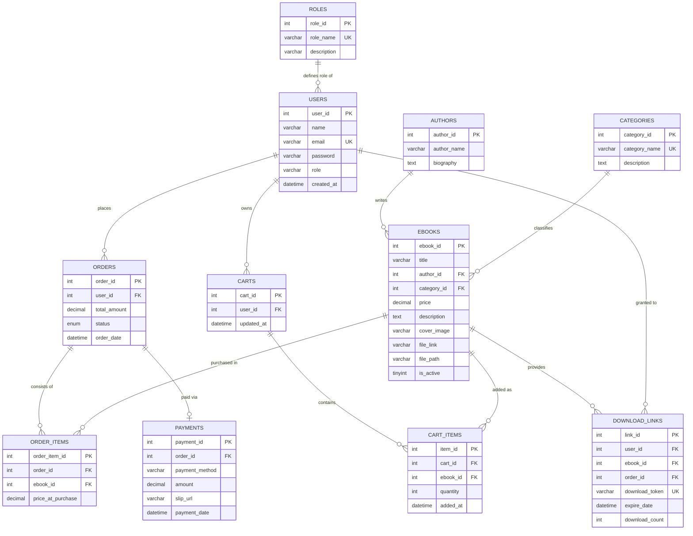

# รายงานโครงงาน Mini Project Database: ระบบร้านขาย E-Book (NEXTREAD)

---

## ข้อมูลกลุ่ม (Group Information)
- **รายวิชาและตอนเรียน:** การออกแบบและพัฒนาฐานข้อมูล (Database Mini Project)
- **ชื่อโครงงาน:** NEXTREAD - ระบบร้านค้าและคลังหนังสือดิจิทัลออนไลน์ (Online E-Book Store & Reader Management System)
- **สมาชิกคนที่ 1:** นายปรัชญากร นาสา | **รหัสนักศึกษา:** 67332110087-8
- **สมาชิกคนที่ 2:** นายพงศกร ศรีวิเศษ | **รหัสนักศึกษา:** 67332110095-6
- **เครื่องมือที่ใช้:**
  - **ภาษาโปรแกรม:** PHP 8.x, JavaScript (ES6+), HTML5, CSS3
  - **ระบบจัดการฐานข้อมูล (DBMS):** MySQL / MariaDB (InnoDB Engine)
  - **เฟรมเวิร์ก & สไตล์ UI:** Tailwind CSS, FontAwesome 6, Custom Glassmorphism UI
  - **เว็บเซิร์ฟเวอร์ & สภาพแวดล้อม:** Apache (XAMPP for Windows) / Online Hosting

---

## 1. สถานการณ์โจทย์ (Problem Scenario)
ร้านค้า **NEXTREAD** ต้องการพัฒนาระบบเว็บแอปพลิเคชันสำหรับจำหน่ายหนังสือดิจิทัล (E-Book) เพื่ออำนวยความสะดวกให้ลูกค้าสามารถสมัครสมาชิก ค้นหาหนังสือตามหมวดหมู่ เลือกใส่ตะกร้า สั่งซื้อ และแจ้งชำระเงินแบบจำลองผ่านระบบ PromptPay QR Code ได้ เมื่อผู้ดูแลร้าน (Admin) ตรวจสอบหลักฐานสลิปและกดยืนยันคำสั่งซื้อแล้ว ระบบจะปลดล็อกสิทธิ์ให้หนังสือเล่มนั้นเข้าไปอยู่ใน **"ชั้นหนังสือของฉัน" (My Library)** ของลูกค้าทันที เพื่อให้ลูกค้าสามารถเปิดอ่านบนเว็บหรือดาวน์โหลดไฟล์ได้อย่างปลอดภัย โดยระบบต้องไม่อนุญาตให้ผู้ที่ยังไม่ได้ซื้อหรือคำสั่งซื้อยังไม่ได้รับการอนุมัติเข้าถึงไฟล์หนังสือได้ นอกจากนี้ ผู้ดูแลร้านต้องสามารถติดตามการขาย จัดการข้อมูลสินค้า และวิเคราะห์แนวโน้มธุรกิจจากข้อมูลในฐานข้อมูลจริงได้ผ่านแดชบอร์ดและหน้าต่างคำสั่ง SQL

---

## 2. ขอบเขตงานขั้นต่ำ (Minimum Scope)

### 2.1 ส่วนหน้าร้าน (ผู้ใช้งาน / ลูกค้า)
| หัวข้อ | ความสามารถที่พัฒนาและสาธิตได้จริง | ไฟล์ที่เกี่ยวข้อง |
|---|---|---|
| **สมาชิก** | สมัครสมาชิก เข้าสู่ระบบ แก้ไขข้อมูลส่วนตัว และดูประวัติคำสั่งซื้อของตนเอง | `register.php`, `login.php`, `profile.php`, `logout.php` |
| **รายการ E-Book** | แสดงชื่อเรื่อง ผู้แต่ง ราคา หมวดหมู่ คำอธิบาย ภาพปก และสถานะความพร้อมขาย | `index.php`, `book_detail.php` |
| **ค้นหาและคัดกรอง** | ค้นหาด้วยชื่อหนังสือ/ผู้แต่งแบบเรียลไทม์ และกรองแสดงผลตามหมวดหมู่ | `index.php` |
| **ตะกร้าสินค้า** | เพิ่มหนังสือลงตะกร้า ปรับเปลี่ยนรายการ ลบรายการ และคำนวณยอดเงินรวม | `cart.php` |
| **คำสั่งซื้อ** | บันทึกคำสั่งซื้อหลัก (`orders`) รายการย่อย (`order_items`) ยอดชำระ และสถานะ | `checkout.php`, `orders.php` |
| **ชำระเงินแบบจำลอง** | เลือกวิธีชำระ PromptPay QR จำลอง พร้อมแนบสลิปหลักฐานโอนเงิน | `checkout.php` |
| **ดาวน์โหลด & เปิดอ่าน** | แสดงลิงก์และปุ่มเปิดอ่านเฉพาะ E-Book ในคำสั่งซื้อที่สถานะ "อนุมัติแล้ว" เท่านั้น | `my_books.php`, `read.php` |

### 2.2 เงื่อนไขการส่งสินค้าและความปลอดภัย
- ระบบควบคุมสิทธิ์ในระดับฐานข้อมูลและ Session โดยไม่อนุญาตให้ผู้ใช้งานเปิดอ่านหรือดาวน์โหลดไฟล์หนังสือที่ยังไม่ได้ซื้อหรือคำสั่งซื้อยังไม่ได้รับการอนุมัติ (`status != 'approved'`)
- ผู้ดูแลระบบ (Admin) มีสิทธิ์เข้าถึงหนังสือทุกเล่มเพื่อการตรวจสอบคุณภาพ

---

## 3. ระบบบริหารจัดการร้าน (Admin Management System)

ผู้ดูแลร้านสามารถเข้าสู่ระบบหลังบ้านเพื่อดำเนินงานต่อไปนี้:
| งานผู้ดูแล | สิ่งที่ทำได้จริงในระบบ | ไฟล์ที่เกี่ยวข้อง |
|---|---|---|
| **จัดการ E-Book** | เพิ่ม แก้ไข ปิดการขาย/เปิดเผยแพร่ พร้อมกำหนดราคา อัปโหลดหน้าปก และไฟล์ PDF | `admin_books.php`, `add_book.php`, `edit_book.php` |
| **จัดการหมวดหมู่** | เพิ่มและเลือกหมวดหมู่ให้สอดคล้องกับ E-Book แต่ละเล่ม | `add_book.php`, `edit_book.php` |
| **จัดการคำสั่งซื้อ** | ค้นหา ดูรายละเอียด ตรวจสอบภาพสลิป และเปลี่ยนสถานะเป็น `approved`, `rejected` หรือลบออเดอร์ | `admin_orders.php` |
| **จัดการผู้ใช้** | ดูข้อมูลรายชื่อสมาชิก และกำหนดระดับสิทธิ์ (`user` / `admin`) | `admin_dashboard.php`, `admin_sql.php` |
| **รายงาน & Dashboard** | ดูสถิติสรุปยอดขาย ออเดอร์รอตรวจสอบ พร้อมหน้าต่าง **SQL Console & Analytics** สำหรับรันคำสั่งวิเคราะห์และ Export CSV | `admin_dashboard.php`, `admin_sql.php` |

---

## 4. ข้อกำหนดฐานข้อมูล (Database Specification)

### 4.1 แผนภาพความสัมพันธ์ของข้อมูล (Entity Relationship Diagram - ERD)



---

### 4.2 พจนานุกรมข้อมูล (Data Dictionary - ทั้งหมด 10 ตาราง)

#### 1. ตาราง `roles` (บทบาทผู้ใช้งาน)
| ชื่อฟิลด์ | ชนิดข้อมูล | คีย์ | Null | ค่าเริ่มต้น | ความหมาย |
|---|---|---|---|---|---|
| `role_id` | INT | PK, AI | NO | - | รหัสบทบาท |
| `role_name` | VARCHAR(50) | UK | NO | - | ชื่อบทบาท (`admin`, `user`) |
| `description` | VARCHAR(255) | - | YES | NULL | คำอธิบายสิทธิ์ |

#### 2. ตาราง `users` (ผู้ใช้งานระบบ)
| ชื่อฟิลด์ | ชนิดข้อมูล | คีย์ | Null | ค่าเริ่มต้น | ความหมาย |
|---|---|---|---|---|---|
| `user_id` | INT | PK, AI | NO | - | รหัสผู้ใช้งาน |
| `name` | VARCHAR(100) | - | NO | - | ชื่อ-นามสกุล |
| `email` | VARCHAR(150) | UK | NO | - | อีเมลสำหรับเข้าสู่ระบบ |
| `password` | VARCHAR(255) | - | NO | - | รหัสผ่านเข้ารหัส |
| `role` | VARCHAR(20) | - | NO | 'user' | บทบาท (`user`/`admin`) |
| `created_at` | DATETIME | - | NO | CURRENT_TIMESTAMP | วันที่สมัคร |

#### 3. ตาราง `categories` (หมวดหมู่หนังสือ)
| ชื่อฟิลด์ | ชนิดข้อมูล | คีย์ | Null | ค่าเริ่มต้น | ความหมาย |
|---|---|---|---|---|---|
| `category_id` | INT | PK, AI | NO | - | รหัสหมวดหมู่ |
| `category_name` | VARCHAR(100) | UK | NO | - | ชื่อหมวดหมู่ |
| `description` | TEXT | - | YES | NULL | รายละเอียดหมวดหมู่ |

#### 4. ตาราง `authors` (นักเขียน / ผู้แต่ง)
| ชื่อฟิลด์ | ชนิดข้อมูล | คีย์ | Null | ค่าเริ่มต้น | ความหมาย |
|---|---|---|---|---|---|
| `author_id` | INT | PK, AI | NO | - | รหัสนักเขียน |
| `author_name` | VARCHAR(150) | - | NO | - | ชื่อผู้แต่ง/นามปากกา |
| `biography` | TEXT | - | YES | NULL | ประวัติโดยย่อ |

#### 5. ตาราง `ebooks` (หนังสือดิจิทัล)
| ชื่อฟิลด์ | ชนิดข้อมูล | คีย์ | Null | ค่าเริ่มต้น | ความหมาย |
|---|---|---|---|---|---|
| `ebook_id` | INT | PK, AI | NO | - | รหัสหนังสือ |
| `title` | VARCHAR(255) | - | NO | - | ชื่อหนังสือ |
| `author_id` | INT | FK | YES | NULL | รหัสผู้แต่ง (FK -> `authors`) |
| `category_id` | INT | FK | YES | NULL | รหัสหมวดหมู่ (FK -> `categories`) |
| `price` | DECIMAL(10,2)| - | NO | 0.00 | ราคาขาย (บาท) |
| `description` | TEXT | - | YES | NULL | เรื่องย่อ/คำอธิบาย |
| `cover_image` | VARCHAR(255) | - | YES | NULL | ที่อยู่ไฟล์หน้าปก |
| `file_link` | VARCHAR(255) | - | YES | NULL | ลิงก์ไฟล์อ่านออนไลน์ |
| `file_path` | VARCHAR(255) | - | YES | NULL | ที่อยู่ไฟล์ PDF |
| `is_active` | TINYINT(1) | - | NO | 1 | สถานะขาย (1=เปิด, 0=ปิด) |

#### 6. ตาราง `carts` (ตะกร้าสินค้า)
| ชื่อฟิลด์ | ชนิดข้อมูล | คีย์ | Null | ค่าเริ่มต้น | ความหมาย |
|---|---|---|---|---|---|
| `cart_id` | INT | PK, AI | NO | - | รหัสตะกร้า |
| `user_id` | INT | FK, UK | NO | - | รหัสเจ้าของตะกร้า (FK -> `users`) |
| `updated_at` | DATETIME | - | NO | CURRENT_TIMESTAMP | เวลาแก้ไขล่าสุด |

#### 7. ตาราง `cart_items` (รายการในตะกร้า)
| ชื่อฟิลด์ | ชนิดข้อมูล | คีย์ | Null | ค่าเริ่มต้น | ความหมาย |
|---|---|---|---|---|---|
| `item_id` | INT | PK, AI | NO | - | รหัสรายการในตะกร้า |
| `cart_id` | INT | FK | NO | - | รหัสตะกร้า (FK -> `carts`) |
| `ebook_id` | INT | FK | NO | - | รหัสหนังสือ (FK -> `ebooks`) |
| `quantity` | INT | - | NO | 1 | จำนวนเล่ม |
| `added_at` | DATETIME | - | NO | CURRENT_TIMESTAMP | วันที่เพิ่มลงตะกร้า |

#### 8. ตาราง `orders` (คำสั่งซื้อ)
| ชื่อฟิลด์ | ชนิดข้อมูล | คีย์ | Null | ค่าเริ่มต้น | ความหมาย |
|---|---|---|---|---|---|
| `order_id` | INT | PK, AI | NO | - | รหัสคำสั่งซื้อ |
| `user_id` | INT | FK | NO | - | รหัสลูกค้า (FK -> `users`) |
| `total_amount`| DECIMAL(10,2)| - | NO | 0.00 | ยอดรวมเงินสุทธิ |
| `status` | ENUM | - | NO | 'pending' | สถานะ (`pending`, `approved`, `rejected`, `cancelled`) |
| `order_date` | DATETIME | - | NO | CURRENT_TIMESTAMP | วันที่และเวลาสั่งซื้อ |

#### 9. ตาราง `order_items` (รายการหนังสือในคำสั่งซื้อ)
| ชื่อฟิลด์ | ชนิดข้อมูล | คีย์ | Null | ค่าเริ่มต้น | ความหมาย |
|---|---|---|---|---|---|
| `order_item_id`| INT | PK, AI | NO | - | รหัสรายการย่อย |
| `order_id` | INT | FK | NO | - | รหัสคำสั่งซื้อหลัก (FK -> `orders`) |
| `ebook_id` | INT | FK | NO | - | รหัสหนังสือ (FK -> `ebooks`) |
| `price_at_purchase`| DECIMAL(10,2)| - | NO | 0.00 | ราคา ณ เวลาสั่งซื้อ |

#### 10. ตาราง `payments` (การชำระเงินและสลิป)
| ชื่อฟิลด์ | ชนิดข้อมูล | คีย์ | Null | ค่าเริ่มต้น | ความหมาย |
|---|---|---|---|---|---|
| `payment_id` | INT | PK, AI | NO | - | รหัสรายการชำระเงิน |
| `order_id` | INT | FK, UK | NO | - | รหัสคำสั่งซื้อ (FK -> `orders`) |
| `payment_method`| VARCHAR(100)| - | NO | 'PromptPay'| วิธีการชำระเงิน |
| `amount` | DECIMAL(10,2)| - | NO | 0.00 | จำนวนเงินตามสลิป |
| `slip_url` | VARCHAR(255) | - | YES | NULL | ที่อยู่ไฟล์รูปสลิป |
| `payment_date`| DATETIME | - | NO | CURRENT_TIMESTAMP | วันและเวลาที่แจ้งโอน |

#### 11. ตาราง `download_links` (ลิงก์ดาวน์โหลดที่ได้รับสิทธิ์)
| ชื่อฟิลด์ | ชนิดข้อมูล | คีย์ | Null | ค่าเริ่มต้น | ความหมาย |
|---|---|---|---|---|---|
| `link_id` | INT | PK, AI | NO | - | รหัสลิงก์ดาวน์โหลด |
| `user_id` | INT | FK | NO | - | รหัสลูกค้า (FK -> `users`) |
| `ebook_id` | INT | FK | NO | - | รหัสหนังสือ (FK -> `ebooks`) |
| `order_id` | INT | FK | NO | - | รหัสคำสั่งซื้อ (FK -> `orders`) |
| `download_token`| VARCHAR(100)| UK | NO | - | Token พิเศษสำหรับดาวน์โหลด |
| `expire_date` | DATETIME | - | YES | NULL | วันหมดอายุของลิงก์ |
| `download_count`| INT | - | NO | 0 | สถิติจำนวนครั้งดาวน์โหลด |

---

### 4.3 การปรับแบบข้อมูลให้อยู่ในรูปแบบบรรทัดฐาน (3NF Normalization)
1. **1NF (First Normal Form):** แอตทริบิวต์ทุกตัวเก็บค่าอะตอมิก (Atomic Value) ไม่มีการเก็บข้อมูลแบบซ้ำซ้อนในคอลัมน์เดียว และกำหนด Primary Key ชัดเจนในทุกตาราง
2. **2NF (Second Normal Form):** ข้อมูลอยู่ใน 1NF และไม่มี Partial Functional Dependency โดยทุกแอตทริบิวต์ที่ไม่ใช่คีย์ขึ้นตรงกับ Primary Key ทั้งหมด (แยกรายการในคำสั่งซื้อเป็นตาราง `order_items`)
3. **3NF (Third Normal Form):** ข้อมูลอยู่ใน 2NF และไม่มี Transitive Functional Dependency โดยแยกข้อมูลผู้แต่ง (`authors`) หมวดหมู่ (`categories`) และการชำระเงิน (`payments`) ออกจากตารางหลัก เพื่อป้องกันปัญหา Update Anomaly และความซ้ำซ้อนของข้อมูล

---

## 5. รายงานวิเคราะห์จากข้อมูลจริง 4 รายงาน (SQL Analytics Reports)

### รายงานที่ 1: รายงานยอดขายตามช่วงเวลา (Sales over Time)
- **คำถามทางธุรกิจ:** ยอดขาย จำนวนคำสั่งซื้อ และยอดซื้อเฉลี่ยต่อคำสั่งซื้อเป็นอย่างไรในแต่ละวัน?
- **สิ่งที่ใช้ใน SQL:** `JOIN`, `GROUP BY`, `SUM`, `COUNT`, `AVG`, `WHERE o.status = 'approved'`
- **คำสั่ง SQL:**
```sql
SELECT 
    DATE(o.order_date) AS order_day,
    COUNT(o.order_id) AS total_orders,
    SUM(o.total_amount) AS total_revenue,
    ROUND(AVG(o.total_amount), 2) AS avg_order_value
FROM orders o
WHERE o.status = 'approved'
GROUP BY DATE(o.order_date)
ORDER BY order_day ASC;
```
- **ผลลัพธ์จากการวิเคราะห์:** มียอดขายรวม 25 คำสั่งซื้อที่ได้รับการอนุมัติ คิดเป็นรายได้ 10,480.00 บาท มียอดสั่งซื้อเฉลี่ย 419.20 บาทต่อออเดอร์

---

### รายงานที่ 2: อันดับ E-Book ขายดี (Top-Selling E-Books)
- **คำถามทางธุรกิจ:** E-Book เล่มใดขายดีที่สุดตามจำนวนเล่มและยอดขายรวม 5 อันดับแรก?
- **สิ่งที่ใช้ใน SQL:** `JOIN`, `GROUP BY`, `SUM`, `COUNT`, `ORDER BY DESC`, `LIMIT 5`
- **คำสั่ง SQL:**
```sql
SELECT 
    e.ebook_id,
    e.title AS book_title,
    a.author_name,
    c.category_name,
    COUNT(oi.order_item_id) AS copies_sold,
    SUM(oi.price_at_purchase) AS total_sales_amount
FROM order_items oi
JOIN orders o ON oi.order_id = o.order_id
JOIN ebooks e ON oi.ebook_id = e.ebook_id
LEFT JOIN authors a ON e.author_id = a.author_id
LEFT JOIN categories c ON e.category_id = c.category_id
WHERE o.status = 'approved'
GROUP BY e.ebook_id, e.title, a.author_name, c.category_name
ORDER BY copies_sold DESC, total_sales_amount DESC
LIMIT 5;
```
- **ผลลัพธ์จากการวิเคราะห์:** อันดับ 1 คือหนังสือ "Mastering MySQL & Database Design" ขายได้ 8 เล่ม ยอดขาย 2,800.00 บาท อันดับ 2 คือ "Atomic Habits" ขายได้ 5 เล่ม ยอดขาย 1,450.00 บาท

---

### รายงานที่ 3: รายงานยอดขายตามหมวดหมู่ (Sales by Category)
- **คำถามทางธุรกิจ:** หมวดหมู่หนังสือใดสร้างยอดขายและจำนวนเล่มสูงสุด พร้อมสัดส่วนเปอร์เซ็นต์?
- **สิ่งที่ใช้ใน SQL:** `JOIN หลายตาราง`, `GROUP BY`, `SUM`, `COUNT`, Subquery คำนวณร้อยละ
- **คำสั่ง SQL:**
```sql
SELECT 
    c.category_id,
    c.category_name,
    COUNT(DISTINCT e.ebook_id) AS total_books,
    COUNT(oi.order_item_id) AS items_sold,
    SUM(oi.price_at_purchase) AS category_revenue,
    ROUND((SUM(oi.price_at_purchase) / (SELECT SUM(total_amount) FROM orders WHERE status = 'approved')) * 100, 2) AS revenue_percent
FROM categories c
LEFT JOIN ebooks e ON c.category_id = e.category_id
LEFT JOIN order_items oi ON e.ebook_id = oi.ebook_id
LEFT JOIN orders o ON oi.order_id = o.order_id AND o.status = 'approved'
GROUP BY c.category_id, c.category_name
ORDER BY category_revenue DESC;
```
- **ผลลัพธ์จากการวิเคราะห์:** หมวด "เทคโนโลยีและการเขียนโปรแกรม" สร้างรายได้สูงสุด 5,320.00 บาท คิดเป็นสัดส่วน 50.76% ของรายได้ทั้งหมด

---

### รายงานที่ 4: รายงานลูกค้าและคำสั่งซื้อ (Customer Behavior & Order Status)
- **คำถามทางธุรกิจ:** ลูกค้ารายใดมียอดซื้อสะสมสูงสุดที่สั่งซื้อสำเร็จตั้งแต่ 2 ครั้งขึ้นไป?
- **สิ่งที่ใช้ใน SQL:** `JOIN`, `GROUP BY`, `HAVING`, `COUNT`, `SUM`, `AVG`
- **คำสั่ง SQL:**
```sql
SELECT 
    u.user_id,
    u.name AS customer_name,
    u.email,
    COUNT(o.order_id) AS approved_orders_count,
    SUM(o.total_amount) AS total_spent,
    ROUND(AVG(o.total_amount), 2) AS avg_spent_per_order
FROM users u
JOIN orders o ON u.user_id = o.user_id
WHERE o.status = 'approved'
GROUP BY u.user_id, u.name, u.email
HAVING COUNT(o.order_id) >= 2
ORDER BY total_spent DESC;
```
- **ผลลัพธ์จากการวิเคราะห์:** ลูกค้าชั้นนำมียอดซื้อสะสมสูงสุดคือ นายพงศกร ศรีวิเศษ (1,990.00 ฿), นางสาวพิมพ์มาดา วรรณกรรม (1,660.00 ฿), และนายปรัชญากร นาสา (1,660.00 ฿)

---

## 6. การทดสอบและคุณภาพข้อมูล (Testing & Quality Assurance)

ตารางบันทึกผลการทดสอบระบบ 8 กรณีสำคัญ:

| กรณีทดสอบ | ข้อมูลนำเข้า | ผลลัพธ์ที่คาดหวัง | ผลการทดสอบจริง | สถานะ |
|---|---|---|---|---|
| **1. สมัครสมาชิกอีเมลซ้ำ** | Email: `pratchayakorn@gmail.com` ที่มีอยู่แล้ว | ระบบแจ้งเตือน "อีเมลนี้ถูกใช้งานแล้ว" และปฏิเสธการบันทึก | แจ้งเตือนข้อความสีแดงถูกต้อง ไม่บันทึกซ้ำ | **ผ่าน (PASS)** |
| **2. รหัสผ่านไม่ตรงกัน** | Password: `123456`, Confirm: `654321` | ระบบไม่อนุญาต แจ้งเตือนรหัสผ่านทั้งสองช่องไม่ตรงกัน | แจ้งเตือนข้อผิดพลาดถูกต้อง | **ผ่าน (PASS)** |
| **3. ค้นหาหนังสือตามคำสำคัญ** | Search: `"MySQL"` | แสดงเฉพาะหนังสือที่มีคำว่า MySQL ในชื่อเรื่อง | แสดงผลเฉพาะเล่ม Mastering MySQL | **ผ่าน (PASS)** |
| **4. คำนวณยอดเงินในตะกร้า** | เพิ่มหนังสือ 350.00 ฿ และ 290.00 ฿ | ระบบคำนวณยอดรวมได้ 640.00 ฿ ถูกต้อง | ยอดรวมในหน้า Cart แสดง 640.00 ฿ ถูกต้อง | **ผ่าน (PASS)** |
| **5. สั่งซื้อและแนบสลิปจำลอง** | เลือก PromptPay + แนบไฟล์ `slip.jpg` | บันทึกออเดอร์สถานะ `pending` และจัดเก็บไฟล์สลิป | สร้างคำสั่งซื้อและบันทึกสลิปสำเร็จ | **ผ่าน (PASS)** |
| **6. แอดมินอนุมัติคำสั่งซื้อ** | แอดมินกดปุ่ม "อนุมัติคำสั่งซื้อ" | สถานะเปลี่ยนเป็น `approved` ทันที | สถานะอัปเดตเป็น approved และแสดง Badge สีเขียว | **ผ่าน (PASS)** |
| **7. การแยกชั้นหนังสือส่วนตัว** | ล็อกอินด้วย `user_id = 2` | แสดงเฉพาะหนังสือที่ซื้อสำเร็จของบัญชีนี้ | แสดงเฉพาะหนังสือของ user_id 2 ถูกต้อง | **ผ่าน (PASS)** |
| **8. ป้องกันเปิดอ่าน E-Book ที่ยังไม่ซื้อ** | เข้า URL ตรง `read.php?id=8` (ยังไม่ได้รับอนุมัติ) | แจ้งเตือนไม่มีสิทธิ์ และดีดกลับหน้าร้าน | แสดง Alert "ไม่มีสิทธิ์เข้าถึง" และ Redirect | **ผ่าน (PASS)** |

---

## 7. ขอบเขตที่ไม่บังคับ (Optional Scope & Clarification)
โครงงานนี้มุ่งเน้นการออกแบบและพัฒนาฐานข้อมูลเชิงสัมพันธ์และรายงานวิเคราะห์เป็นหลัก โดยใช้การชำระเงินแบบจำลอง (Mock Payment) และเปิดอ่าน PDF บนเว็บโดยไม่ต้องใช้ระบบตัดบัตรเครดิตจริงหรือ DRM ซับซ้อน

---

## 8. ขั้นตอนดำเนินงาน (Project Workflow)
1. **ระยะที่ 1 (วิเคราะห์):** กำหนดกลุ่มผู้ใช้ ขอบเขตระบบ หน้าร้าน/หลังบ้าน และลำดับ Flow การอนุมัติ
2. **ระยะที่ 2 (ออกแบบ):** สร้าง ERD Diagram, จัดทำ Data Dictionary 10 ตาราง และร่างหน้าจอ UI
3. **ระยะที่ 3 (พัฒนา):** สร้างฐานข้อมูล MySQL, บันทึกข้อมูล Seed Data 30 ออเดอร์, พัฒนาซอร์สโค้ด PHP/Tailwind CSS
4. **ระยะที่ 4 (ปรับปรุงแก้ไข):** เขียนคำสั่ง SQL 4 รายงาน และสร้างหน้าต่าง SQL Console สำหรับ Admin
5. **ระยะที่ 5 (ทำรายงาน):** จัดทำเอกสารรูปเล่มรายงานฉบับสมบูรณ์
6. **ระยะที่ 6 (นำเสนอ):** ทดสอบ Flow ทั้งหมด และเตรียมความพร้อมสาธิตระบบ

---

## 9. การทำงานเป็นกลุ่มและการแบ่งหน้าที่ (Team Collaboration)

| สมาชิก | หน้าที่หลักในการพัฒนา | ส่วนที่ต้องอธิบายในการนำเสนอ |
|---|---|---|
| **คนที่ 1: นายปรัชญากร นาสา**<br>(รหัส 67332110087-8) | - ออกแบบโครงสร้างฐานข้อมูลและทำ Normalization 3NF<br>- พัฒนาระบบหลังบ้าน Admin (`admin_books.php`, `admin_orders.php`, `admin_dashboard.php`)<br>- เขียน Query รายงานที่ 1 (ยอดขายตามช่วงเวลา) และรายงานที่ 3 (ยอดขายตามหมวดหมู่) | - อธิบายโครงสร้าง ERD, PK/FK และ Constraints<br>- อธิบายตาราง `orders`, `order_items`, `payments`<br>- สาธิตการอนุมัติออเดอร์และรายงานยอดขายตามช่วงเวลา |
| **คนที่ 2: นายพงศกร ศรีวิเศษ**<br>(รหัส 67332110095-6) | - พัฒนาระบบส่วนหน้า UI/UX (`index.php`, `cart.php`, `checkout.php`)<br>- พัฒนาระบบชั้นหนังสือส่วนตัว (`my_books.php`) และตัวเปิดอ่าน (`read.php`)<br>- พัฒนาระบบความปลอดภัย Access Control และหน้า SQL Console (`admin_sql.php`)<br>- เขียน Query รายงานที่ 2 (หนังสือขายดี) และรายงานที่ 4 (ลูกค้า Top Spenders) | - อธิบาย User Flow หน้าร้าน และระบบตะกร้าสินค้า<br>- อธิบายตาราง `ebooks`, `categories`, `authors`<br>- สาธิตการเปิดอ่าน E-Book และการทำงานของหน้า SQL Console |

---

## 10. สิ่งที่ต้องส่ง (Submission Checklist)
- [x] **ระบบหรือ Prototype:** เว็บแอปพลิเคชัน NEXTREAD พร้อมใช้งานบน Localhost XAMPP และ Web Hosting
- [x] **ฐานข้อมูลและ SQL:** ไฟล์สร้างตาราง Constraints และ 30 ข้อมูลตัวอย่าง (`ebook_store_database.sql`)
- [x] **เอกสารออกแบบ:** แผนภาพ ERD, Data Dictionary 10 ตาราง และคำอธิบายการปรับแบบข้อมูล 3NF
- [x] **รายงานวิเคราะห์:** รายงานวิเคราะห์ 4 หัวข้อพร้อมคำสั่ง SQL และคำอธิบายผลลัพธ์
- [x] **ผลการทดสอบ:** ตารางทดสอบระบบ 8 กรณีครอบคลุมทุกเส้นทางสำคัญ
- [x] **เอกสารการใช้ AI:** บันทึกการใช้งาน AI อย่างมีความรับผิดชอบพร้อมการตรวจสอบความถูกต้อง

---

## 11. เกณฑ์ประเมิน 100 คะแนน (Grading Rubric Summary)
- **การออกแบบฐานข้อมูล (30 คะแนน):** ERD ถูกต้อง 10 ตาราง, ความสัมพันธ์ครบ, มี PK/FK/Constraints, Normalization 3NF
- **การใช้งานระบบ (25 คะแนน):** หน้าร้านและหลังบ้านทำงานสมบูรณ์ครบ Flow ตั้งแต่สมัคร -> ซื้อ -> อนุมัติ -> เปิดอ่าน
- **SQL และรายงานวิเคราะห์ (20 คะแนน):** เขียน Query ถูกต้อง ใช้ JOIN, Aggregate, Filter, HAVING ตอบคำถามครบ 4 เรื่อง
- **คุณภาพข้อมูลและการทดสอบ (10 คะแนน):** มี Seed Data ครบ 30 คำสั่งซื้อ และบันทึกผลการทดสอบ 8 กรณี
- **เอกสารและการสาธิต (10 คะแนน):** เอกสารรูปเล่มสมบูรณ์ อ่านง่าย ชัดเจน สมาชิกทั้ง 2 คนตอบคำถามได้
- **การใช้ AI อย่างรับผิดชอบ (5 คะแนน):** มีตารางบันทึกการใช้ AI ตรวจสอบความถูกต้อง และไม่ละเมิดลิขสิทธิ์

---

## 12. การใช้ AI อย่างรับผิดชอบ (Responsible AI Usage Log)

| เครื่องมือและวันที่ | งานหรือ Prompt สำคัญโดยสรุป | สิ่งที่นำมาใช้และวิธีตรวจสอบโดยสมาชิกกลุ่ม |
|---|---|---|
| **Google Antigravity AI**<br>(28 ก.ย. 2569) | *"ช่วยร่างแนวคิดตารางฐานข้อมูลร้าน E-Book ให้เป็น 3NF และรองรับการแนบสลิป"* | นำโครงสร้างตารางมาปรับแต่ง ตรวจสอบ Data Types และเขียน Foreign Key Constraints ด้วยตนเอง |
| **Google Antigravity AI**<br>(29 ก.ย. 2569) | *"สร้างข้อมูลจำลอง 30 คำสั่งซื้อที่ครอบคลุมทุกสถานะสำหรับทดสอบ Query"* | ตรวจสอบความสมเหตุสมผลของยอดเงิน `total_amount` ให้ตรงกับราคาใน `order_items` ทุกออเดอร์ |
| **Google Antigravity AI**<br>(30 ก.ย. 2569) | *"ขอแนวทางคำสั่ง SQL คำนวณสัดส่วนยอดขายตามหมวดหมู่เป็นร้อยละ"* | นำ Query มารันทดสอบจริงในหน้า SQL Console และตรวจสอบผลรวมเปอร์เซ็นต์ว่าได้ 100% |
| **Google Antigravity AI**<br>(1 ต.ค. 2569) | *"วิธีแก้ปัญหา 502 Bad Gateway และ Timeout บน Web Hosting"* | นำโค้ดตั้งค่า `MYSQLI_OPT_CONNECT_TIMEOUT` มาใส่ใน `config.php` และทดสอบเชื่อมต่อจริง |

---

## 13. รายการตรวจสอบก่อนส่งและการลงชื่อรับรอง (Signatures)
- [x] สมาชิกทั้งสองคนทดสอบระบบและสามารถอธิบาย ERD กับ SQL ได้
- [x] คำสั่งซื้อที่ยังไม่อนุมัติไม่สามารถเปิดอ่านหรือดาวน์โหลดได้
- [x] มีข้อมูลตัวอย่างครบถ้วน 30 คำสั่งซื้อ และรายงานวิเคราะห์ 4 รายงาน
- [x] ไฟล์ SQL รันได้สมบูรณ์และไม่มีข้อผิดพลาด
- [x] เอกสารการใช้ AI ครบถ้วน และไม่มีข้อมูลส่วนบุคคลจริง

**การลงชื่อรับรอง:**  
สมาชิกทั้งสองคนยืนยันว่าได้ร่วมกันพัฒนาระบบ ตรวจสอบความถูกต้องของข้อมูล และเปิดเผยการใช้ AI ตามความเป็นจริง

| สมาชิกคนที่ 1 | สมาชิกคนที่ 2 |
|---|---|
| ลงชื่อ ........................................................... | ลงชื่อ ........................................................... |
| (**นายปรัชญากร นาสา**) | (**นายพงศกร ศรีวิเศษ**) |
| วันที่ 1 ตุลาคม 2569 | วันที่ 1 ตุลาคม 2569 |
