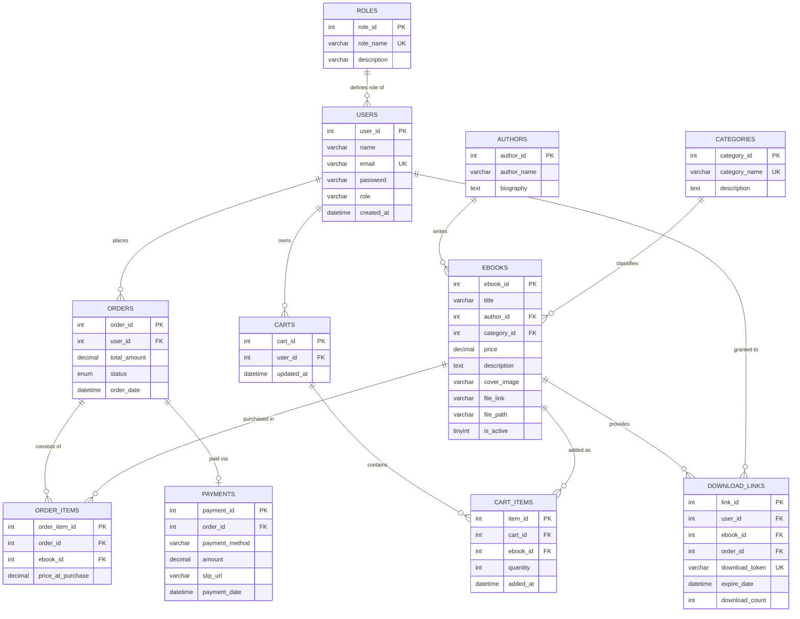
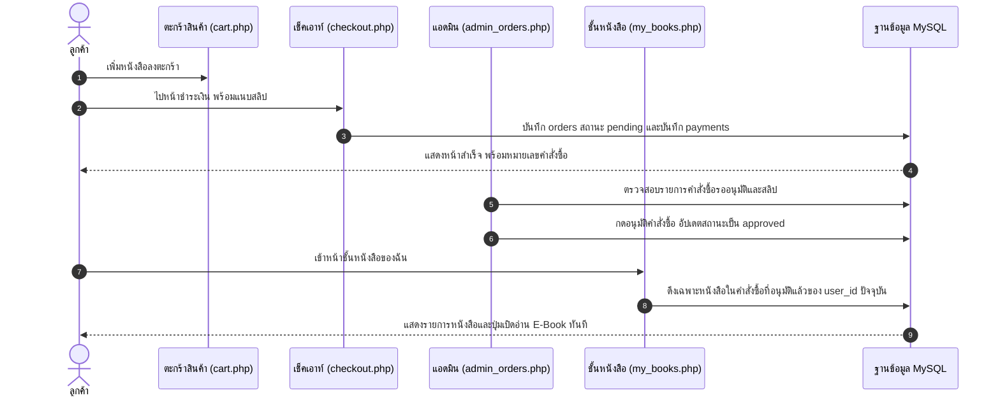
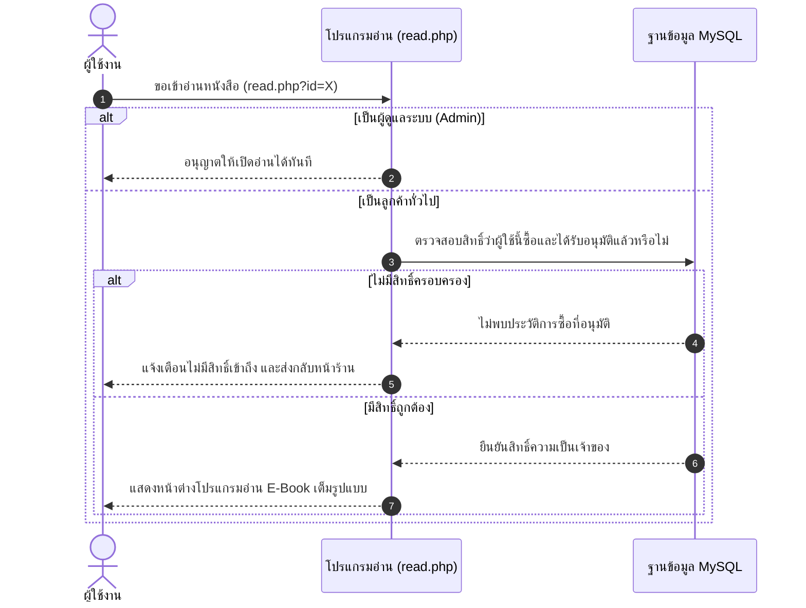

# สรุปการพัฒนาระบบร้านค้าและคลังหนังสือดิจิทัล NEXTREAD (ฉบับล่าสุด)

> **เวอร์ชัน:** 2.4.0 (Latest Final Edition)  
> **ปรับปรุงล่าสุด:** 1 ตุลาคม 2569  
> **กลุ่มผู้พัฒนา:** 
> 1. นายปรัชญากร นาสา (รหัส 67332110087-8)
> 2. นายพงศกร ศรีวิเศษ (รหัส 67332110095-6)

---

## 1. ภาพรวมสถาปัตยกรรมระบบ (System Architecture Diagram)

```mermaid
flowchart TB
    subgraph ClientLayer["ส่วนหน้าบ้าน (Customer Frontend)"]
        User["ผู้ใช้งานทั่วไป / ลูกค้า"]
        Auth["ระบบยืนยันตัวตน (login.php / register.php)"]
        Catalog["ค้นหาและคัดกรอง E-Book (index.php / book_detail.php)"]
        Cart["ตะกร้าสินค้า (cart.php)"]
        Checkout["ชำระเงินจำลองและแนบสลิป (checkout.php)"]
        Orders["ประวัติคำสั่งซื้อ (orders.php)"]
        Shelf["ชั้นหนังสือของฉัน (my_books.php)"]
        Reader["โปรแกรมอ่าน E-Book (read.php)"]
    end

    subgraph AdminLayer["ส่วนหลังบ้าน (Admin Dashboard & Tools)"]
        Admin["ผู้ดูแลระบบ (Role: admin)"]
        Dash["แดชบอร์ดภาพรวม (admin_dashboard.php)"]
        ManageBooks["จัดการ E-Book (admin_books.php / add_book.php / edit_book.php)"]
        ManageOrders["ตรวจสอบสลิปและอนุมัติออเดอร์ (admin_orders.php)"]
        SQLConsole["SQL Query Console & Analytics (admin_sql.php)"]
    end

    subgraph DBLayer["ฐานข้อมูลและไฟล์ (Database & Storage)"]
        MySQL[("MySQL Database (10 Tables)")]
        Uploads["โฟลเดอร์ uploads (covers, slips, pdfs)"]
    end

    User --> Auth
    Auth --> Catalog --> Cart --> Checkout --> Orders
    Orders -.->|เมื่อสถานะอนุมัติ| Shelf --> Reader
    
    Admin --> Dash
    Dash --> ManageBooks
    Dash --> ManageOrders
    Dash --> SQLConsole
    
    ManageOrders -->|อนุมัติคำสั่งซื้อ| Orders
    ManageBooks <--> MySQL
    ManageOrders <--> MySQL
    SQLConsole <--> MySQL
    Checkout --> Uploads
    Reader <-- Uploads
```

---

## 2. แผนภาพความสัมพันธ์ของฐานข้อมูล (Entity Relationship Diagram - ERD ล่าสุด)



---

## 3. แผนผังลำดับขั้นตอนการทำงาน (Sequence Diagrams)

### 3.1 วงจรชีวิตการสั่งซื้อและการอนุมัติ (Checkout & Approval Lifecycle)



### 3.2 การควบคุมสิทธิ์การเปิดอ่านหนังสือ (Security & Reader Flow)



---

## 4. สรุปฟีเจอร์และเครื่องมือทั้งหมดในระบบ (Complete Feature Matrix)

| หมวดหมู่ | รายละเอียดความสามารถ | ไฟล์ที่เกี่ยวข้อง |
|---|---|---|
| **หน้าร้านค้า & ค้นหา** | ค้นหาแบบเรียลไทม์, คัดกรองตามหมวดหมู่, แสดงการ์ด 3D Hover | `index.php`, `book_detail.php` |
| **ระบบสมาชิก & สิทธิ์** | สมัครสมาชิก, เข้ารหัสผ่าน Password Hash, แยกบทบาท Admin/User | `register.php`, `login.php`, `profile.php`, `logout.php` |
| **ตะกร้า & ชำระเงิน** | คำนวณยอดเงินอัตโนมัติ, แจ้งโอนเงิน PromptPay QR, อัปโหลดสลิป | `cart.php`, `checkout.php`, `orders.php` |
| **คลังหนังสือ & การอ่าน** | แยกชั้นหนังสือตามผู้ใช้แต่ละคน, โปรแกรมอ่าน PDF Online | `my_books.php`, `read.php` |
| **การจัดการหนังสือ** | เพิ่ม/แก้ไข/ลบ E-Book, อัปโหลดไฟล์หน้าปกและ PDF | `admin_books.php`, `add_book.php`, `edit_book.php` |
| **การจัดการคำสั่งซื้อ** | ตรวจสอบสลิป, กรองสถานะ, อนุมัติ/ปฏิเสธ/ลบคำสั่งซื้อ | `admin_orders.php`, `admin_dashboard.php` |
| **SQL Console & Analytics** | หน้าต่างรัน SQL อิสระ, ปุ่มลัดรายงาน 8 รูปแบบ, Export CSV | `admin_sql.php` |

---

## 5. สรุปประวัติการแก้ไขปัญหาทางเทคนิค (Bug Fixes & Improvements)

1. **การแก้ปัญหา 502 Bad Gateway บน Web Hosting:**
   - *สาเหตุ:* การเชื่อมต่อฐานข้อมูลค้างจน Nginx Reverse Proxy ตัดการทำงาน และ PHP 8.1+ Exception Crash
   - *วิธีแก้:* ปรับปรุง [config.php](file:///c:/xampp/htdocs/ebook-store/config.php) ให้ตรวจจับ Localhost/Live Host อัตโนมัติ, กำหนด `MYSQLI_OPT_CONNECT_TIMEOUT = 5` วินาที, ปิด Fatal Crash และแสดงหน้าต่าง Diagnostic ที่ชัดเจน
2. **การแก้ปัญหาการแยกชั้นหนังสือรายบุคคล (User Library Isolation):**
   - *วิธีแก้:* ตรวจสอบและบังคับเงื่อนไข `WHERE o.user_id = ? AND o.status = 'approved'` ทั้งใน [my_books.php](file:///c:/xampp/htdocs/ebook-store/my_books.php) และ [read.php](file:///c:/xampp/htdocs/ebook-store/read.php) เพื่อให้ผู้ใช้แต่ละคนเห็นเฉพาะหนังสือของตัวเอง
3. **การแก้ปัญหาข้อผิดพลาด `Unknown column 'e.created_at'` ใน SQL Console:**
   - *สาเหตุ:* คำสั่ง Preset 6 มีการเรียกคอลัมน์ `created_at` ที่ไม่มีอยู่ในตาราง `ebooks`
   - *วิธีแก้:* ปรับปรุง Preset คำสั่งใน [admin_sql.php](file:///c:/xampp/htdocs/ebook-store/admin_sql.php) ให้ตรงกับฟิลด์จริง และเพิ่มระบบ Auto-Correct ชื่อตาราง `e-book` -> `ebooks`
4. **การแก้ปัญหาหน้าเว็บค้างเวลากดย้อนกลับ (BFCache):**
   - *วิธีแก้:* ใส่ Header `Cache-Control: no-cache, no-store, must-revalidate` ป้องกันเบราว์เซอร์จำ Cache เก่า

---

## 6. โครงสร้างไฟล์ทั้งหมดในโปรเจกต์ (Project Directory Structure)

```
c:/xampp/htdocs/ebook-store/
├── assets/                          # สไตล์และสคริปต์ UI
│   ├── app.js
│   └── style.css
├── docs/                            # เอกสารและแผนภาพ Flow การทำงาน
│   ├── 00_system_overview.md
│   ├── 01_auth_flow.md
│   ├── 02_catalog_flow.md
│   ├── 03_checkout_flow.md
│   ├── 04_admin_orders_flow.md
│   ├── 05_admin_books_flow.md
│   └── 06_reader_flow.md
├── uploads/                         # แหล่งจัดเก็บไฟล์ที่อัปโหลด
│   ├── covers/                      # รูปภาพปกหนังสือ
│   ├── pdfs/                        # ไฟล์ E-Book PDF ดิจิทัล
│   └── slips/                       # รูปภาพสลิปหลักฐานการโอนเงิน
├── add_book.php                     # เพิ่มหนังสือใหม่สำหรับ Admin
├── admin_books.php                  # จัดการหนังสือสำหรับ Admin
├── admin_dashboard.php              # แดชบอร์ดสรุปยอดขายและสถิติ
├── admin_orders.php                 # ตรวจสอบสลิปและอนุมัติคำสั่งซื้อ
├── admin_sql.php                    # หน้าต่าง SQL Console & รายงานวิเคราะห์
├── book_detail.php                  # หน้ารายละเอียดหนังสือ
├── cart.php                         # ตะกร้าสินค้า
├── checkout.php                     # ชำระเงินจำลองและแนบสลิป
├── config.php                       # ตั้งค่าฐานข้อมูล & ตรวจสิทธิ์ระบบ
├── DATABASE_MINI_PROJECT_REPORT.md  # เล่มรายงานโครงงานฉบับสมบูรณ์ (100 คะแนน)
├── ebook_store_database.sql         # ไฟล์ SQL Schema + 30 Seed Data
├── edit_book.php                    # แก้ไขข้อมูลหนังสือ
├── index.php                        # หน้าร้านค้าหลัก
├── login.php                        # เข้าสู่ระบบ
├── logout.php                       # ออกจากระบบ
├── my_books.php                     # ชั้นหนังสือส่วนตัว
├── orders.php                       # ประวัติคำสั่งซื้อของลูกค้า
├── profile.php                      # โปรไฟล์ส่วนตัว
├── PROJECT_SUMMARY.md               # เอกสารสรุปการพัฒนาระบบและ Diagram ล่าสุด
├── read.php                         # ตัวเปิดอ่าน E-Book ออนไลน์
└── register.php                     # สมัครสมาชิก
```
