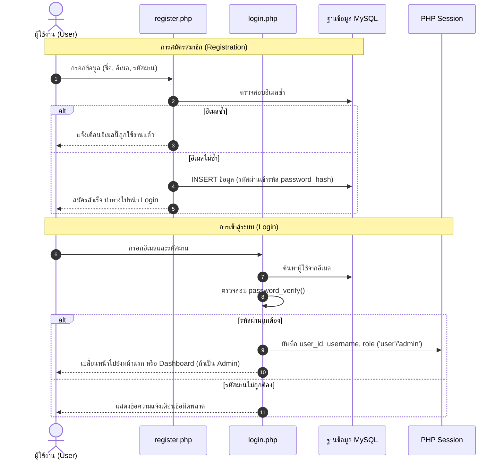

# 01. ขั้นตอนระบบยืนยันตัวตน (Authentication Flow)

## 📌 ไฟล์ที่เกี่ยวข้อง
- [register.php](file:///c:/xampp/htdocs/ebook-store/register.php) : หน้าสมัครสมาชิก
- [login.php](file:///c:/xampp/htdocs/ebook-store/login.php) : หน้าเข้าสู่ระบบ
- [logout.php](file:///c:/xampp/htdocs/ebook-store/logout.php) : หน้าออกจากระบบ
- [profile.php](file:///c:/xampp/htdocs/ebook-store/profile.php) : หน้าดูและแก้ไขข้อมูลส่วนตัว

---

## 🔄 ลำดับขั้นตอนการทำงาน (Flow Steps)

---

## 🔒 การควบคุมสิทธิ์ (Access Control)
- ฟังก์ชัน `isLoggedIn()` ตรวจสอบค่า `$_SESSION['user_id']`
- ฟังก์ชัน `isAdmin()` ตรวจสอบค่า `$_SESSION['role'] === 'admin'`
