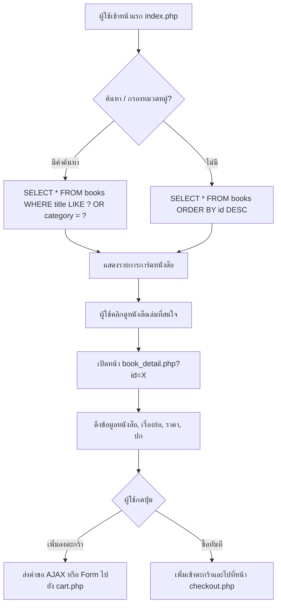

# 02. ขั้นตอนการเลือกดูและค้นหาหนังสือ (Catalog Flow)

## 📌 ไฟล์ที่เกี่ยวข้อง
- [index.php](file:///c:/xampp/htdocs/ebook-store/index.php) : หน้าแรก แสดงหนังสือทั้งหมด, ตัวกรองหมวดหมู่ และช่องค้นหา
- [book_detail.php](file:///c:/xampp/htdocs/ebook-store/book_detail.php) : หน้ารายละเอียดหนังสือ

---

## 🔄 ลำดับขั้นตอนการทำงาน (Flow Steps)

