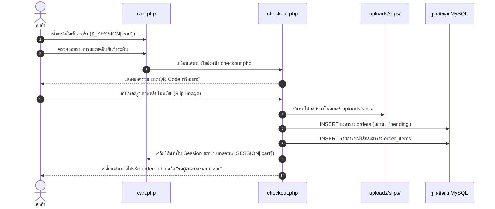

# 03. ขั้นตอนตะกร้าสินค้าและการสั่งซื้อ/ชำระเงิน (Cart & Checkout Flow)

## 📌 ไฟล์ที่เกี่ยวข้อง
- [cart.php](file:///c:/xampp/htdocs/ebook-store/cart.php) : จัดการสินค้าในตะกร้า (เก็บใน Session `$_SESSION['cart']`)
- [checkout.php](file:///c:/xampp/htdocs/ebook-store/checkout.php) : คำนวณยอดเงินรวม, แสดง QR Code พร้อมเพย์, อัปโหลดสลิปหลักฐาน

---

## 🔄 ลำดับขั้นตอนการทำงาน (Flow Steps)

