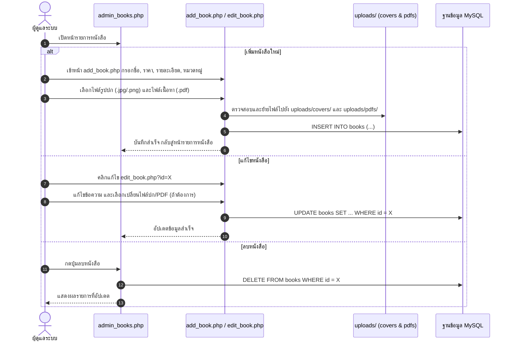

# 05. ขั้นตอนการจัดการหนังสือของผู้ดูแลระบบ (Admin Books Flow)

## 📌 ไฟล์ที่เกี่ยวข้อง
- [admin_books.php](file:///c:/xampp/htdocs/ebook-store/admin_books.php) : ตารางรายการหนังสือทั้งหมด, ปุ่มเพิ่ม/แก้ไข/ลบ
- [add_book.php](file:///c:/xampp/htdocs/ebook-store/add_book.php) : ฟอร์มเพิ่มหนังสือใหม่ + อัปโหลดหน้าปก & ไฟล์ PDF
- [edit_book.php](file:///c:/xampp/htdocs/ebook-store/edit_book.php) : ฟอร์มแก้ไขข้อมูลหนังสือ

---

## 🔄 ลำดับขั้นตอนการทำงาน (Flow Steps)

