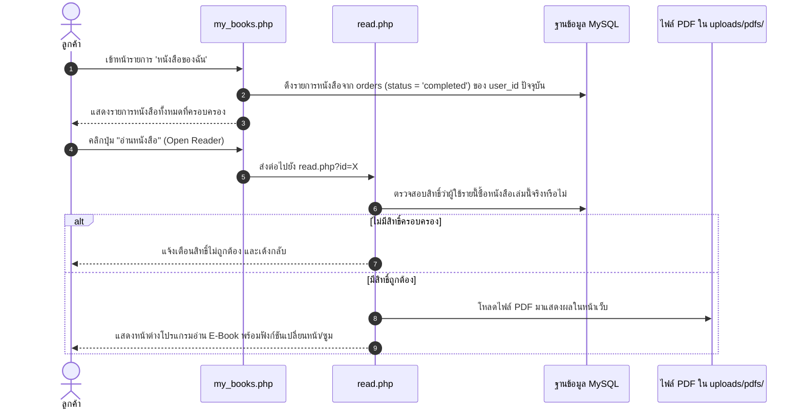

# 06. ขั้นตอนการเข้าอ่าน E-Book และชั้นหนังสือของฉัน (Reader Flow)

## 📌 ไฟล์ที่เกี่ยวข้อง
- [my_books.php](file:///c:/xampp/htdocs/ebook-store/my_books.php) : หน้าชั้นหนังสือส่วนตัว แสดงเฉพาะหนังสือที่ซื้อสำเร็จแล้ว
- [read.php](file:///c:/xampp/htdocs/ebook-store/read.php) : ตัวเปิดอ่าน E-Book แบบออนไลน์ (PDF Viewer / Reader)
- [orders.php](file:///c:/xampp/htdocs/ebook-store/orders.php) : หน้าดูประวัติคำสั่งซื้อทั้งหมด

---

## 🔄 ลำดับขั้นตอนการทำงาน (Flow Steps)

